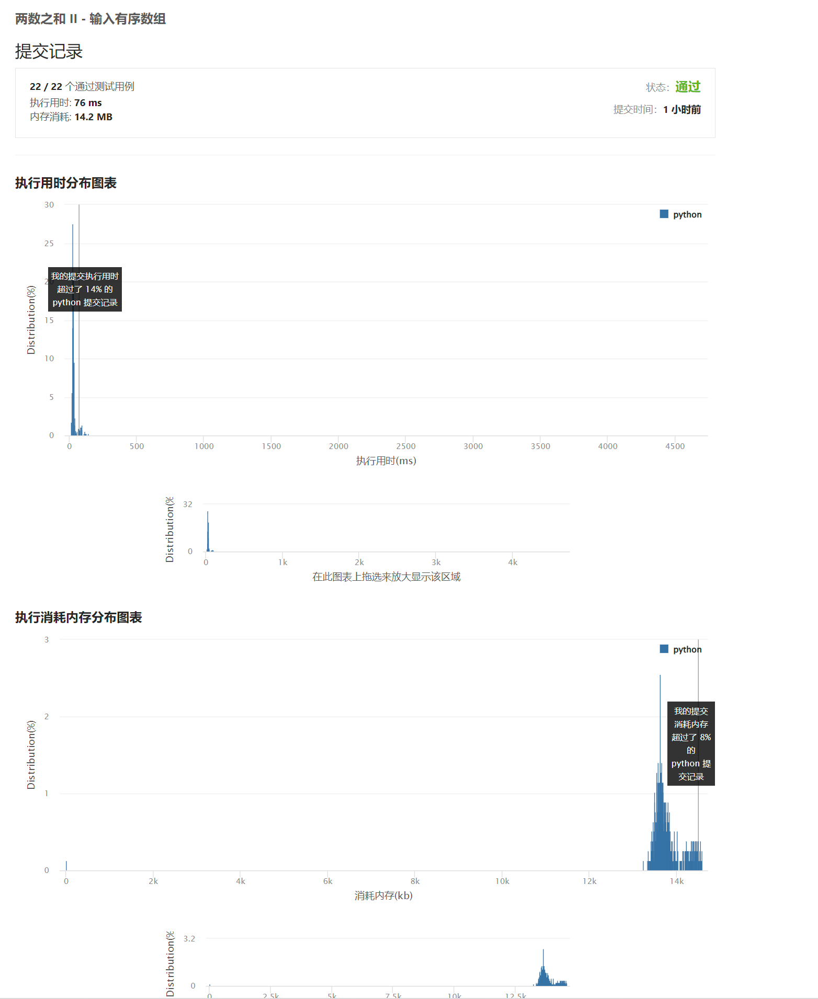

#### [167. 两数之和 II - 输入有序数组](https://leetcode.cn/problems/two-sum-ii-input-array-is-sorted/)

题意：有序查找直接二分，遍历一次，中间使用二分查找第二个值(target - x)。

时间复杂度: `O(n log(n))`
空间复杂度: `O(1)`

```python
# 给你一个下标从 1 开始的整数数组 numbers ，该数组已按 非递减顺序排列 ，请你从数组中找出满足相加之和等于目标数 target 的两个数。如果设这
# 两个数分别是 numbers[index1] 和 numbers[index2] ，则 1 <= index1 < index2 <= numbers.
# length 。
#
#  以长度为 2 的整数数组 [index1, index2] 的形式返回这两个整数的下标 index1 和 index2。
#
#  你可以假设每个输入 只对应唯一的答案 ，而且你 不可以 重复使用相同的元素。
#
#  你所设计的解决方案必须只使用常量级的额外空间。
#
#  示例 1：
#
#
# 输入：numbers = [2,7,11,15], target = 9
# 输出：[1,2]
# 解释：2 与 7 之和等于目标数 9 。因此 index1 = 1, index2 = 2 。返回 [1, 2] 。
#
#  示例 2：
#
#
# 输入：numbers = [2,3,4], target = 6
# 输出：[1,3]
# 解释：2 与 4 之和等于目标数 6 。因此 index1 = 1, index2 = 3 。返回 [1, 3] 。
#
#  示例 3：
#
#
# 输入：numbers = [-1,0], target = -1
# 输出：[1,2]
# 解释：-1 与 0 之和等于目标数 -1 。因此 index1 = 1, index2 = 2 。返回 [1, 2] 。
#
#
#
#
#  提示：
#
#
#  2 <= numbers.length <= 3 * 10⁴
#  -1000 <= numbers[i] <= 1000
#  numbers 按 非递减顺序 排列
#  -1000 <= target <= 1000
#  仅存在一个有效答案
#
#
#  Related Topics 数组 双指针 二分查找 👍 981 👎 0


class Solution(object):
    def binary_search(self, li, left, right, target):
        while left + 1 < right:
            mid = (left + right) // 2
            if li[mid] == target:
                return mid
            if li[mid] < target:
                left = mid
            else:
                right = mid
        if li[left] == target:
            return left
        if li[right] == target:
            return right
        return

    def twoSum(self, numbers, target):
        """
        时间复杂度 O(n logn) 空间复杂度O(1)
        :type numbers: List[int]
        :type target: int
        :rtype: List[int]
        """
        if not numbers:
            return
        for i in range(0, len(numbers)):
            tmp = target - numbers[i]
            t = self.binary_search(numbers, i + 1, len(numbers) - 1, tmp)
            if t:
                return [i + 1, t + 1]
        return


case_list = [2, 7, 11, 15]
case_num = 9
print(Solution().twoSum(case_list, case_num))
case_list = [2, 3, 4]
case_num = 6
print(Solution().twoSum(case_list, case_num))
case_list = [-1, 0]
case_num = -1
print(Solution().twoSum(case_list, case_num))
```

