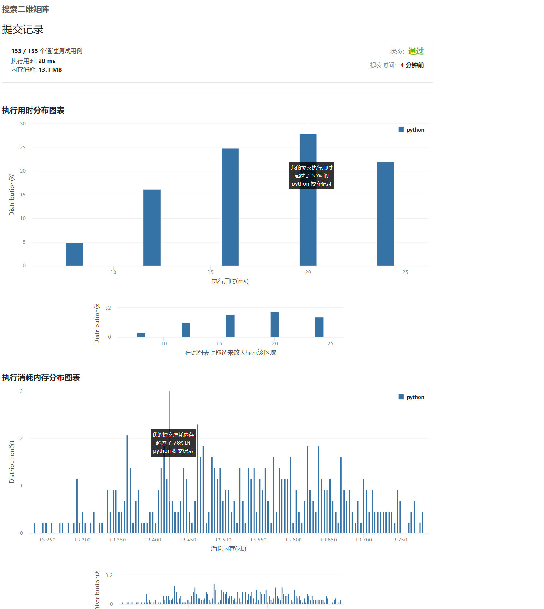

#### [74. 搜索二维矩阵](https://leetcode.cn/problems/search-a-2d-matrix/)

题意：二维数组，有序，遍历外层数据，在使用二分查找。

时间复杂度: `O(log(M*N))`
空间复杂度: `O(1)`

```python
# 编写一个高效的算法来判断 m x n 矩阵中，是否存在一个目标值。该矩阵具有如下特性： 
# 
#  
#  每行中的整数从左到右按升序排列。 
#  每行的第一个整数大于前一行的最后一个整数。 
#  
# 
#  
# 
#  示例 1： 
#  
#  
# 输入：matrix = [[1,3,5,7],[10,11,16,20],[23,30,34,60]], target = 3
# 输出：true
#  
# 
#  示例 2： 
#  
#  
# 输入：matrix = [[1,3,5,7],[10,11,16,20],[23,30,34,60]], target = 13
# 输出：false
#  
# 
#  
# 
#  提示： 
# 
#  
#  m == matrix.length 
#  n == matrix[i].length 
#  1 <= m, n <= 100 
#  -10⁴ <= matrix[i][j], target <= 10⁴ 
#  
# 
#  Related Topics 数组 二分查找 矩阵 👍 762 👎 0


class Solution(object):
    def searchMatrix(self, matrix, target):
        """
        暴力解法 
        时间复杂度O(n)
        空间复杂度O(n)
        
        :type matrix: List[List[int]]
        :type target: int
        :rtype: bool
        """
        for i in matrix:
            s = set(i)
            if target in s:
                return True
        return False

class Solution(object):
    def searchMatrix(self, matrix, target):
        """
        常规解法
        时间复杂度O(m logn)
        空间复杂度O(1)
        
        :type matrix: List[List[int]]
        :type target: int
        :rtype: bool
        """
        for i in matrix:
            start, end = 0, len(i) - 1
            if target > i[end]:
                continue
            while start + 1 < end:
                mid = (start + end) // 2
                if target == i[mid]:
                    return True
                if target > i[mid]:
                    start = mid
                else:
                    end = mid
            if target == i[start] or target == i[end]:
                return True
        return False
    
    
class Solution(object):
    def searchMatrix(self, matrix, target):
        """
        优雅解法
        时间复杂度O(log(M*N))
        空间复杂度O(1)
        
        :type matrix: List[List[int]]
        :type target: int
        :rtype: bool
        """
        if not matrix:
            return False
        h, w = len(matrix), len(matrix[0])
        start, end = 0, w * h - 1
        while start <= end:
            mid = (start + end) // 2
            i, j = mid // w, mid % w
            if matrix[i][j] == target:
                return True
            if matrix[i][j] < target:
                start = mid + 1
            else:
                end = mid - 1

        return False
    
matrix = [[1, 3, 5, 7], [10, 11, 16, 20], [23, 30, 34, 60]]
target = 40
print(Solution().searchMatrix(matrix, target))
```


