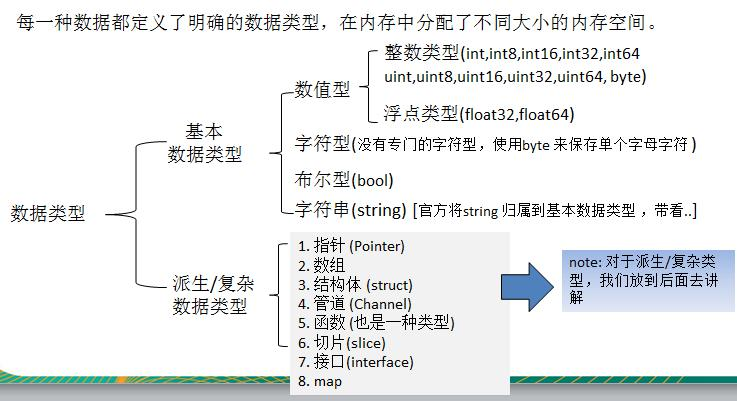
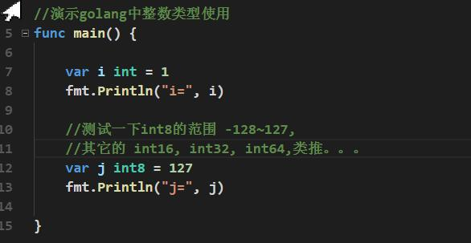
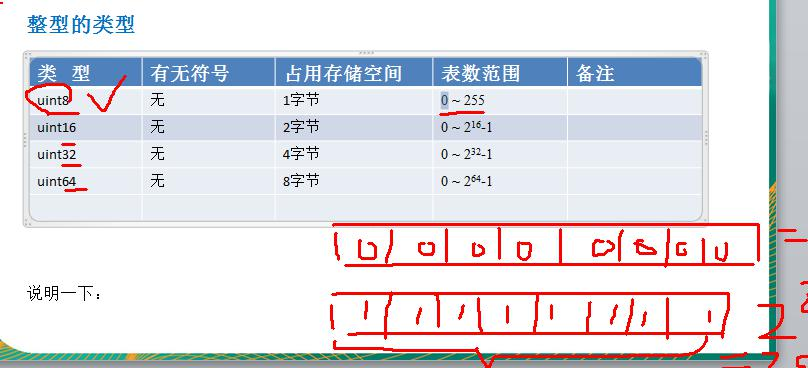
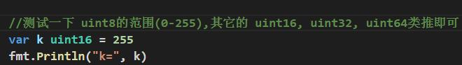
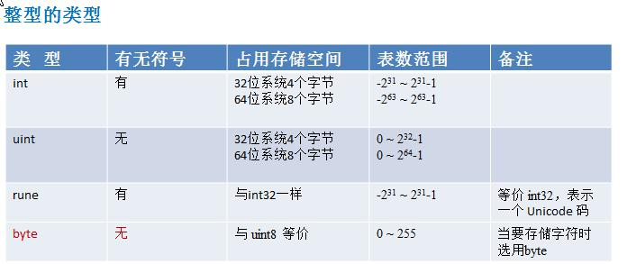
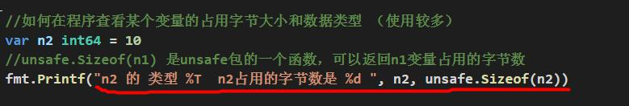

# 数据类型的基本介绍 

## 整数类型

基本介绍 

简单的说，就是**用于存放整数值**的，比如 0, -1, 2345 等等

### 整数的各个类型 

### int 的无符号的类型：

### int 的其它类型的说明: 

整型的使用细节 

1) Golang 各整数类型分：有符号和无符号，int uint 的大小和系统有关。 

2) Golang 的整型默认声明为 int 型 

3) 如何在程序查看某个变量的字节大小和数据类型 （使用较多）

4) Golang 程序中整型变量在使用时，遵守保小不保大的原则，即：在保证程序正确运行下，尽量 

使用占用空间小的数据类型。【如：年龄】 

5) bit: 计算机中的最小存储单位。byte:计算机中基本存储单元。[二进制再详细说] 1byte = 8 bit 

