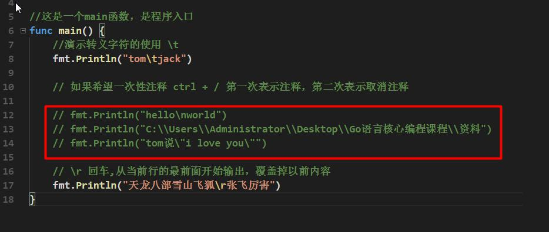
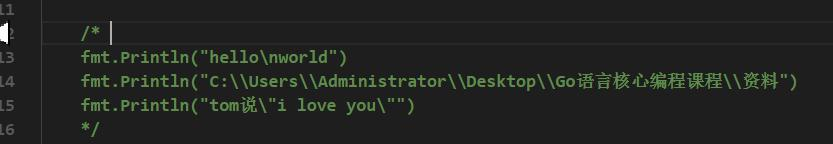

# 1.3 注释(comment) 

## 介绍注释 

用于注解说明解释程序的文字就是注释，**注释提高了代码的阅读性**； 

注释是一个程序员必须要具有的良好编程习惯。将自己的思想通过注释先整理出来，再用代码去 

体现。

2.11.2 在 Golang 中注释有两种形式 

1) 行注释 

 基本语法 

// 注释内容 

 举例

2) 块注释(多行注释) 

 基本语法 

/*

注释内容 

*/ 

 举例说明 

使用细节 

1) 对于行注释和块注释，被注释的文字，不会被 Go 编译器执行。 

2) 块注释里面不允许有块注释嵌套 [注意一下]