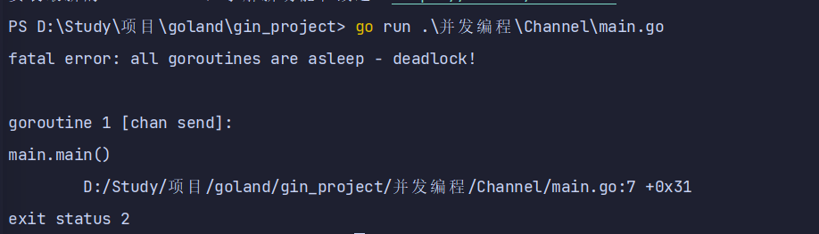
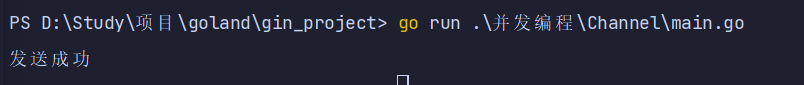
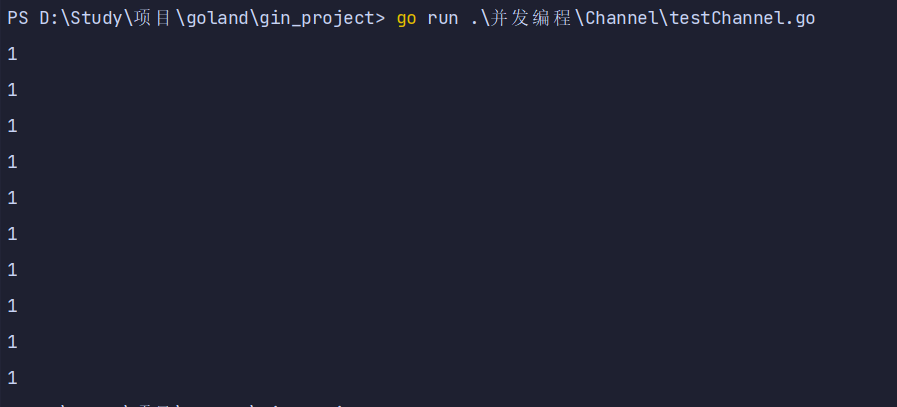
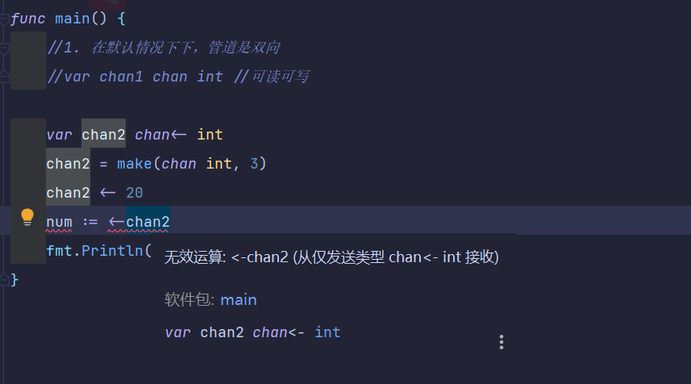
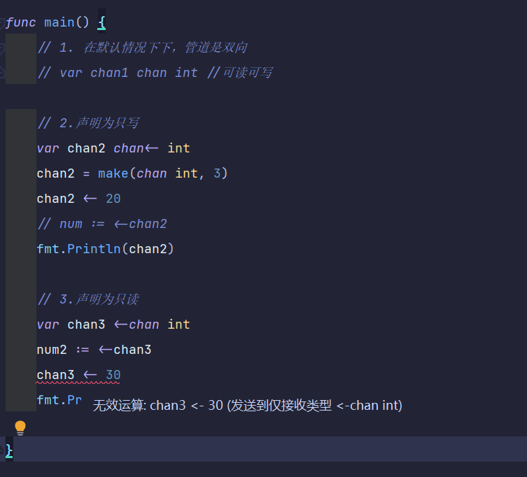
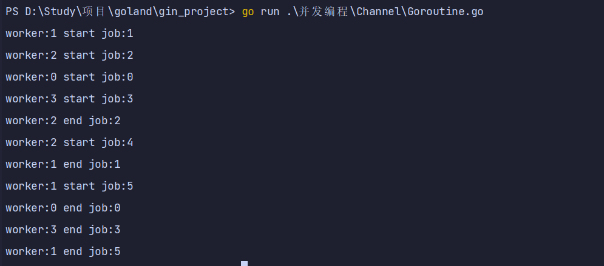

# Channel

## Channel 管道

### Channel说明

- 共享内存交互数据弊端
  - 单纯地将函数并发执行是没有意义的。函数与函数间需要交换数据才能体现并发执行函数的意义。
  - 虽然可以使用共享内存进行数据交换，但是共享内存在不同的goroutine中容易发生竞态问题。
  - 为了保证数据交换的正确性，必须使用互斥量对内存进行加锁，这种做法势必造成性能问题。
- channel好处
  - Go 语言中的通道（channel）是一种特殊的类型。
  - 通道像一个传送带或者队列，总是遵循先入先出（First In First Out）的规则，保证收发数据的顺序。
  - 每一个通道都是一个具体类型的导管，也就是声明channel的时候需要为其指定元素类型。
  - 如果说goroutine是Go程序并发的执行体，channel就是它们之间的连接。
  - channel是可以让一个goroutine发送特定值到另一个goroutine的通信机制。

### channel类型

- channel 是一种类型，一种引用类型
- 声明管道类型的格式如下:

```go
var 变量 chan 元素类型
var ch1 chan int     // 声明一个传递整型的管道
var ch2 chan bool    // 声明一个传递布尔型的管道
var ch3 chan []int    // 声明一个传递 int 切片的管道
```

### 创建channel

- 声明的管道后需要使用 make 函数初始化之后才能使用。
- 创建 **channel** 的格式如下：`make(chan 元素类型, 容量)`

```go
// 创建一个能存储 10 个 int 类型数据的管道
ch1 := make(chan int, 10)
// 创建一个能存储 4 个 bool 类型数据的管道
ch2 := make(chan bool, 4)
// 创建一个能存储 3 个[]int 切片类型数据的管道
ch3 := make(chan []int, 3)
```

## channel操作

- 管道有发送（send）、接收(receive）和关闭（close）三种操作。
- 发送和接收都使用<-符号。
- 现在我们先使用以下语句定义一个管道：

```go
ch := make(chan int, 3)
```

### 发送（将数据放在管道内）

- 将一个值发送到管道中。

```go
ch <- 10  // 把 10 发送到 ch 中
```

### 接收（从管道内取值）

- 从一个管道中接收值。

```go
x := <- ch     // 从 ch 中接收值并赋值给变量 x
<-ch        // 从 ch 中接收值，忽略结果
```

### 关闭管道

- 我们通过调用内置的 close 函数来关闭管道: `close(ch)`
- 关于关闭管道需要注意的事情是，只有在通知接收方 goroutine 所有的数据都发送完毕的时候才需要关闭管道。
- 管道是可以被垃圾回收机制回收的，它和关闭文件是不一样的，在结束操作之后关闭文件是必须要做的，但关闭管道不是必须的。
- 关闭后的管道有以下特点：
  - 对一个关闭的管道再发送值就会导致 panic。
  - 对一个关闭的管道进行接收会一直获取值直到管道为空
  - 对一个关闭的并且没有值的管道执行接收操作会得到对应类型的零值。
  - 关闭一个已经关闭的管道会导致 panic。

### 管道阻塞

#### 无缓冲的管道

- 如果创建管道的时候没有指定容量，那么我们可以叫这个管道为无缓冲的管道
- 无缓冲的管道又称为阻塞的管道。

```go
package main
import "fmt"

func main() {
	ch := make(chan int)
	ch <- 10
	fmt.Println("发送成功")
}
/*
-- 面这段代码能够通过编译，但是执行的时候会出现以下错误
 */
```




#### 有缓冲的管道

- 解决上面问题的方法还有一种就是使用有缓冲区的管道。
- 我们可以在使用 make 函数初始化管道的时候为其指定管道的容量
- 只要管道的容量大于零，那么该管道就是有缓冲的管道，管道的容量表示管道中能存放元素的数量。
- 就像你小区的快递柜只有那么个多格子，格子满了就装不下了，就阻塞了，等到别人取走一个快递员就能往里面放一个。

```go
package main

import "fmt"

func main() {
	ch := make(chan int, 5)
	ch <- 10
	ch <- 12
	fmt.Println("发送成功")
}

```




## 从channel取值

### 优雅的从channel取值

- 当通过通道发送有限的数据时，我们可以通过close函数关闭通道来告知从该通道接收值的goroutine停止等待。
- 当通道被关闭时，往该通道发送值会引发panic，从该通道里接收的值一直都是类型零值。
- 那如何判断一个通道是否被关闭了呢？
- for range的方式判断通道关闭

```go
package main

import "fmt"

func test1(ch chan int) {
	for i := 0; i < 10; i++ {
		ch <- 1
	}
	close(ch)
}

func test2(ch1 chan int, ch2 chan int) {
	for {
		i, ok := <-ch1 // 通道关闭后再取值ok=false
		if !ok {
			break
		}
		ch2 <- i * i
	}
	close(ch2)
}

func main() {
	ch1 := make(chan int)
	ch2 := make(chan int)
	// 开启goroutine将0~10的数发送到ch1中
	go test1(ch1)
	// 开启goroutine从ch1中接收值，并将该值的平方发送到ch2中
	go test2(ch1, ch2)
	// 在主goroutine中从ch2中接收值打印
	for i := range ch2 { // 通道关闭后会退出for range循环
		fmt.Println(i)
	}
}

```



### Goroutine结合Channel管道

- 需求 **1**：定义两个方法，一个方法给管道里面写数据，一个给管道里面读取数据，要求同步进行。
- 1、开启一个 fn1 的的协程给向管道 inChan 中写入 100 条数据
- 2、开启一个 fn2 的协程读取 inChan 中写入的数据
- 3、注意：fn1 和 fn2 同时操作一个管道
- 4、主线程必须等待操作完成后才可以退出
- `注：for range的方式判断通道关闭，推出程序`

```go
package main

import (
	"fmt"
	"sync"
	"time"
)

var wg sync.WaitGroup

func main() {
	intCh := make(chan int, 10)
	wg.Add(2)
	go write(intCh)
	go read(intCh)
	wg.Wait()
	fmt.Println("读取完毕")
}

func write(intCh chan int) {
	defer wg.Done()
	for i := 0; i < 10; i++ {
		intCh <- i
	}
	close(intCh)
}

func read(intCh chan int) {
	defer wg.Done()
	for v := range intCh {
		fmt.Println(v)
		time.Sleep(time.Second)
	}
}

```


## 单向管道

- 有的时候我们会将管道作为参数在多个任务函数间传递
- 很多时候我们在不同的任务函数中使用管道都会对其进行限制
- 比如限制管道在函数中只能发送或只能接收

```go
package main

import "fmt"

func main() {
	// 1. 在默认情况下下，管道是双向
	// var chan1 chan int //可读可写

	// 2.声明为只写
	var chan2 chan<- int
	chan2 = make(chan int, 3)
	chan2 <- 20
	// num := <-chan2
	fmt.Println(chan2)

	// 3.声明为只读
	var chan3 <-chan int
	num2 := <-chan3
	//chan3 <- 30
	fmt.Println(num2)

}

```





## Goroutine池

- 本质上是生产者消费者模型
- 在工作中我们通常会使用可以指定启动的goroutine数量–`worker pool`模式，控制`goroutine`的数量，防止`goroutine`泄漏和暴涨。
- 一个简易的`work pool`示例代码如下：

```go
package main

import (
	"fmt"
	"time"
)

func worker(id int, jobs <-chan int, results chan<- int) {
	for j := range jobs {
		fmt.Printf("worker:%d start job:%d\n", id, j)
		time.Sleep(time.Second)
		fmt.Printf("worker:%d end job:%d\n", id, j)
		results <- j * 2
	}
}

func main() {
	jobs := make(chan int, 100)
	results := make(chan int, 100)
	// 开启3个 goroutine

	for w := 0; w <= 3; w++ {
		go worker(w, jobs, results)
	}

	// 5个任务
	for w := 0; w <= 5; w++ {
		jobs <- w
	}

	close(jobs)

	// 输出结果
	for a := 1; a <= 5; a++ {
		<-results
	}
}

```

