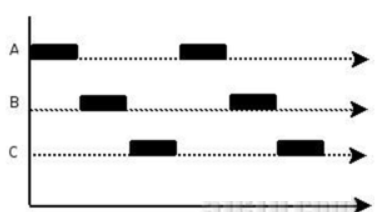
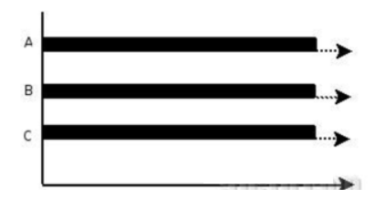

# goroutine介绍

## 并发介绍

### 并发和并行

```text
A. 多线程程序在一个核的cpu上运行，就是并发。
B. 多线程程序在多个核的cpu上运行，就是并行。
```

* 并发：本质还是串行



* 并行：任务分布在不同CPU上，同一时间点同时执行



### 协程和线程

* 协程：独立的栈空间，共享堆空间，调度由用户自己控制，本质上有点类似于用户级线程，这些用户级线程的调度也是自己实现的。
* 线程：一个线程上可以跑多个协程，协程是轻量级的线程。

## goroutine

### 多线程编程缺点

* 在java/c++中我们要实现并发编程的时候，我们通常需要自己维护一个线程池
* 并且需要自己去包装一个又一个的任务，同时需要自己去调度线程执行任务并维护上下文切换

### gouroutine

* Go语言中的goroutine就是这样一种机制，goroutine的概念类似于线程，但 goroutine是由Go的运行时（runtime）调度和管理的。
* Go程序会智能地将 goroutine 中的任务合理地分配给每个CPU。
* Go语言之所以被称为现代化的编程语言，就是因为它在语言层面已经内置了调度和上下文切换的机制。
* 在Go语言编程中你不需要去自己写进程、线程、协程，你的技能包里只有一个技能–goroutine
* 当你需要让某个任务并发执行的时候，你只需要把这个任务包装成一个函数
* 开启一个goroutine去执行这个函数就可以了，就是这么简单粗暴。


