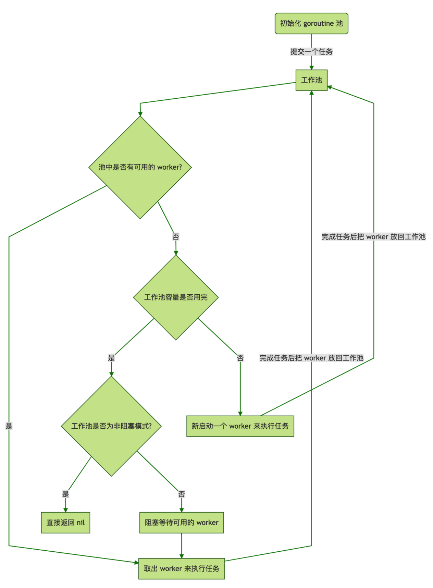

# goroutine原理\(Not finishing\)

## 设计思路

* [参考博客](https://strikefreedom.top/high-performance-implementation-of-goroutine-pool)
* [goroutine](https://draveness.me/golang/docs/part3-runtime/ch06-concurrency/golang-goroutine/#651-设计原理)

### 设计描述

* 启动服务之时先初始化一个 Goroutine Pool 池，这个 Pool 维护了一个类似栈的 LIFO 队列 ，里面存放负责处理任务的 Worker
* 然后在 client 端提交 task 到 Pool 中之后，在 Pool 内部，接收 task 之后的核心操作是
  * 检查当前 Worker 队列中是否有可用的 Worker，如果有，取出执行当前的 task；
  * 没有可用的 Worker，判断当前在运行的 Worker 是否已超过该 Pool 的容量
  * 每个 Worker 执行完任务之后，放回 Pool 的队列中等待



### Pool struct

```go
type sig struct{}

type f func() error

// pool从客户端获取任务，它限制goroutines总数，并且回收再使用
type Pool struct {
    capacity int32                   // 协程池容量
    running int32                    // 正在运行的goroutine数量
    expiryDuration time.Duration     // 为每个worker设置一个过期时间
    workers []*Worker                // 存放空闲 worker,请求进入 Pool先检查workers若有则取出绑定任务执行
    release chan sig                 // 当关闭该 Pool 支持通知所有 worker 退出运行以防 goroutine 泄露
    lock sync.Mutex                  // 同步操作锁
    once sync.Once                   // 确保 Pool 关闭操作只会执行一次
}
```

### 初始化 Pool 并启动定期清理过期 worker 任务

```go
// 新建一个线程池实例
func NewPool(size int) (*Pool, error) {
    return NewTimingPool(size, DefaultCleanIntervalTime)
}

// 产生一个带有自定义定时器的线程池实例
func NewTimingPool(size, expiry int) (*Pool, error) {
    if size <= 0 {
        return nil, ErrInvalidPoolSize
    }
    if expiry <= 0 {
        return nil, ErrInvalidPoolExpiry
    }
    p := &Pool{
        capacity:       int32(size),
        freeSignal:     make(chan sig, math.MaxInt32),
        release:        make(chan sig, 1),
        expiryDuration: time.Duration(expiry) * time.Second,
    }
    // 启动定期清理过期worker任务，独立goroutine运行，进一步节省系统资源
    p.monitorAndClear()
    return p, nil
}
```

### 提交任务到 Pool

* 第一个 if 判断当前 Pool 是否已被关闭，若是则不再接受新任务，否则获取一个 Pool 中可用的 worker，绑定该 `task` 执行。

```go
// Submit submit a task to pool
func (p *Pool) Submit(task f) error {
    if len(p.release) > 0 {
        return ErrPoolClosed
    }
    w := p.getWorker()
    w.task <- task
    return nil
}
```

### 获取可用 worker\(核心\)

* `p.getWorker()` 源码

```go
// 返回一个可用的worker来运行这些任务。
func (p *Pool) getWorker() *Worker {
    var w *Worker
    waiting := false    // 标志变量，判断当前正在运行的worker数量是否已到达Pool的容量上限
    p.lock.Lock()       // 加锁，检测队列中是否有可用worker，并进行相应操作
    idleWorkers := p.workers
    n := len(idleWorkers) - 1
    if n < 0 {     // 当前队列中无可用worker
        // 判断运行worker数目已达到该Pool的容量上限，置等待标志
        waiting = p.Running() >= p.Cap()
    } else {        // 当前队列有可用worker，从队列尾部取出一个使用
        w = idleWorkers[n]
        idleWorkers[n] = nil
        p.workers = idleWorkers[:n]
    }

    p.lock.Unlock()      // 检测完成，解锁
    if waiting {     // Pool容量已满，新请求等待
        for {         // 利用锁阻塞等待直到有空闲worker
            p.lock.Lock()
            idleWorkers = p.workers
            l := len(idleWorkers) - 1
            if l < 0 {
                p.lock.Unlock()
                continue
            }
            w = idleWorkers[l]
            idleWorkers[l] = nil
            p.workers = idleWorkers[:l]
            p.lock.Unlock()
            break
        }
        // 当前无空闲worker但是Pool还没有满，则可以直接新开一个worker执行任务
    } else if w == nil {
        w = &Worker{
            pool: p,
            task: make(chan f, 1),
        }
        w.run()
        // 运行worker数加一
        p.incRunning()
    }
    return w
}
```

### 执行任务

* 结合前面的 `p.Submit(task f)` 和 `p.getWorker()` ，提交任务到 Pool 之后，获取一个可用 worker
* 每新建一个 worker 实例之时都需要调用 `w.run()` 启动一个 goroutine 监听 worker 的任务列表 `task` ，一有任务提交进来就执行；
* 所以，当调用 worker 的 `sendTask(task f)` 方法提交任务到 worker 的任务队列之后，马上就可以被接收并执行
* 当任务执行完之后，会调用 `w.pool.putWorker(w *Worker)` 方法将这个已经执行完任务的 worker 从当前任务解绑放回 Pool 中，以供下个任务可以使用
* 至此，一个任务从提交到完成的过程就此结束，Pool 调度将进入下一个循环。

```go
// Worker是运行任务的实际执行者，它启动一个接受任务并执行函数调用的goroutine
type Worker struct {
    pool *Pool   // 每个pool对应一个worker
    task chan f  // 任务是一项应该完成的工作
    recycleTime time.Time     // 当将一个worker放回队列时，recycleTime将被更新。
}

// Run启动一个goroutine以重复执行函数调用的过程
func (w *Worker) run() {
    go func() {
        // 循环监听任务列表，一旦有任务立马取出运行
        for f := range w.task {
            if f == nil {
                // 退出goroutine，运行worker数减一
                w.pool.decRunning()
                return
            }
            f()
            // worker回收复用
            w.pool.putWorker(w)
        }
    }()
}
```

### worker回收\(goroutine 复用\)

```go
// putWorker将一个worker放回空闲池，回收goroutines
func (p *Pool) putWorker(worker *Worker) {
    // 写入回收时间，亦即该worker的最后一次结束运行的时间
    worker.recycleTime = time.Now()
    p.lock.Lock()
    p.workers = append(p.workers, worker)
    p.lock.Unlock()
}
```

### 动态扩容或者缩小池容量

```go
// ReSize更改此池的容量
func (p *Pool) ReSize(size int) {
    if size == p.Cap() {
        return
    }
    atomic.StoreInt32(&p.capacity, int32(size))
    diff := p.Running() - size
    if diff > 0 {
        for i := 0; i < diff; i++ {
            p.getWorker().task <- nil
        }
    }
}
```

### 定期清理过期 Worker

* 定期检查空闲 worker 队列中是否有已过期的 worker 并清理
* 因为采用了 LIFO 后进先出队列存放空闲 worker，所以该队列默认已经是按照 worker 的最后运行时间由远及近排序
* 可以方便地按顺序取出空闲队列中的每个 worker 并判断它们的最后运行时间与当前时间之差是否超过设置的过期时长
* 若是，则清理掉该 goroutine，释放该 worker，并且将剩下的未过期 worker 重新分配到当前 Pool 的空闲 worker 队列中，进一步节省系统资源

```go
//  定期清理过期 Worker
func (p *Pool) periodicallyPurge() {
    heartbeat := time.NewTicker(p.expiryDuration)
    for range heartbeat.C {
        currentTime := time.Now()
        p.lock.Lock()
        idleWorkers := p.workers
        if len(idleWorkers) == 0 && p.Running() == 0 && len(p.release) > 0 {
            p.lock.Unlock()
            return
        }
        n := 0
        for i, w := range idleWorkers {
            if currentTime.Sub(w.recycleTime) <= p.expiryDuration {
                break
            }
            n = i
            w.task <- nil
            idleWorkers[i] = nil
        }
        n++
        if n >= len(idleWorkers) {
            p.workers = idleWorkers[:0]
        } else {
            p.workers = idleWorkers[n:]
        }
        p.lock.Unlock()
    }
}
```

## pool使用

### 公共池

```go
package main

import (
    "fmt"
    "sync"
    "time"

    "github.com/panjf2000/ants/v2"
)

func demoFunc() {
    time.Sleep(10 * time.Millisecond)
    fmt.Println("Hello World!")
}

func main() {
    // 在retrieveWorker()中可能有一些调用者在等待，因此我们需要唤醒它们来防止那些无限阻塞的调用者
    defer ants.Release()
    var wg sync.WaitGroup
    syncCalculateSum := func() {
        demoFunc()
        wg.Done()
    }
    for i := 0; i < 1000; i++ {
        wg.Add(1)
        _ = ants.Submit(syncCalculateSum)
    }
    wg.Wait()
    fmt.Printf("running goroutines: %d\n", ants.Running())
    fmt.Printf("finish all tasks.\n")
}

/*
    Hello World!
    Hello World!
    running goroutines: 1000
    finish all tasks.
 */
```

### 方法绑定池

```go
package main

import (
    "fmt"
    "github.com/panjf2000/ants/v2"
    "sync"
)

func myFunc(i interface{}) {
    fmt.Printf("run with %d\n", i)
}

func main() {
    defer ants.Release()
    var wg sync.WaitGroup
    // 使用池和函数，设置goroutine pool的容量为10，超时时间为1秒。
    p, _ := ants.NewPoolWithFunc(10, func(i interface{}) {
        myFunc(i)
        wg.Done()
    })
    defer p.Release()
    // 逐个提交任务
    for i := 0; i < 1000; i++ {
        wg.Add(1)
        _ = p.Invoke(int32(i))
    }
    wg.Wait()
    fmt.Printf("running goroutines: %d\n", p.Running())
}

/*
run with 976
run with 990
run with 971
running goroutines: 10
 */
```


