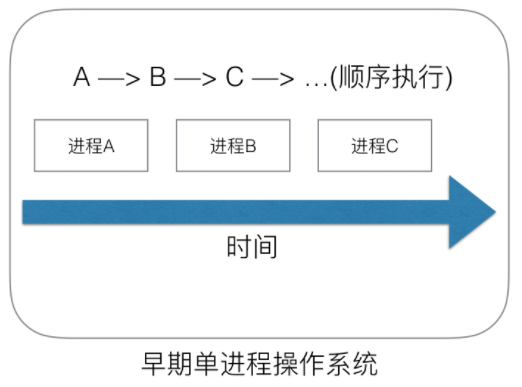
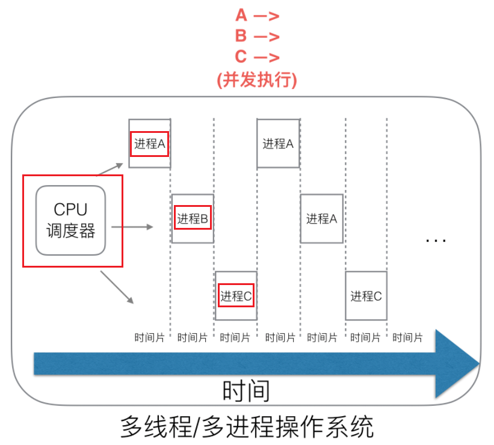
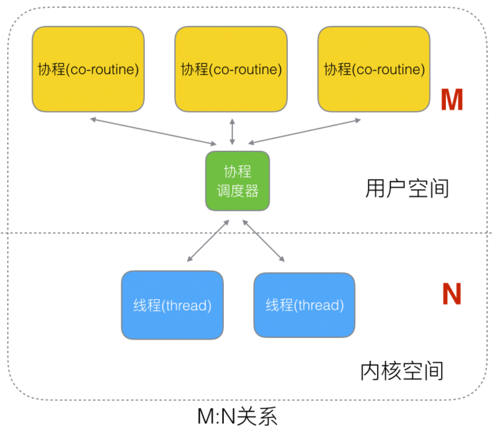
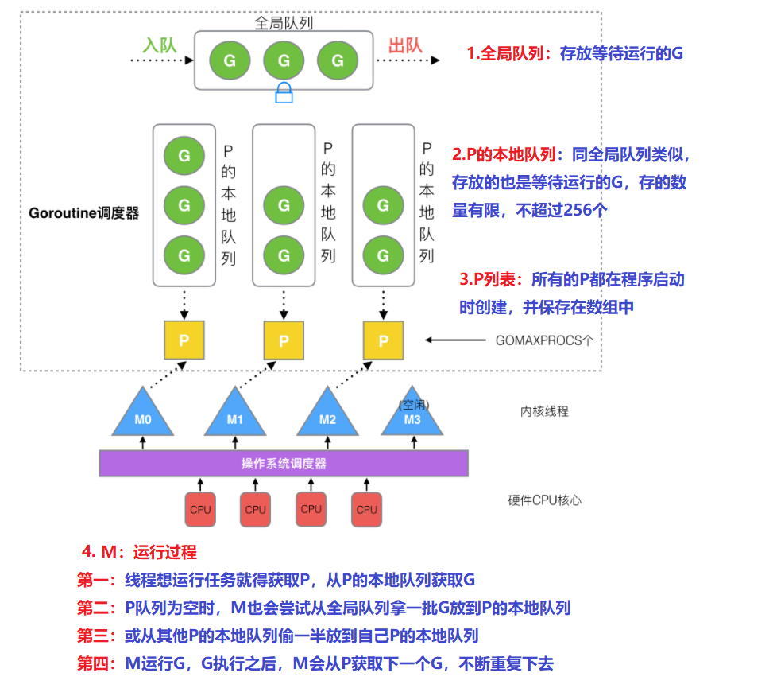
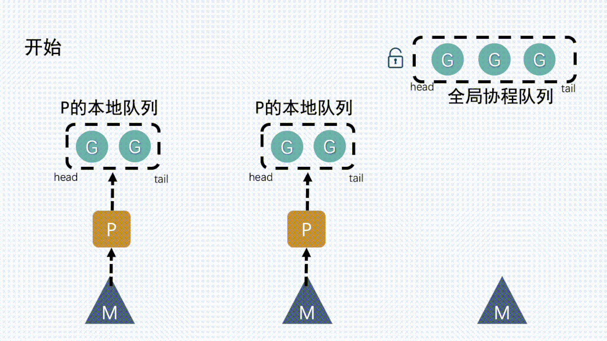
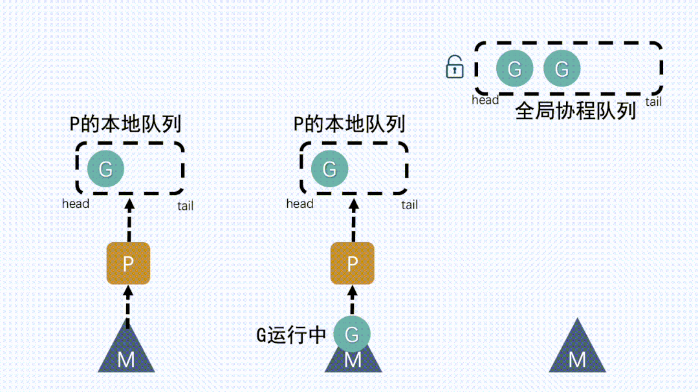
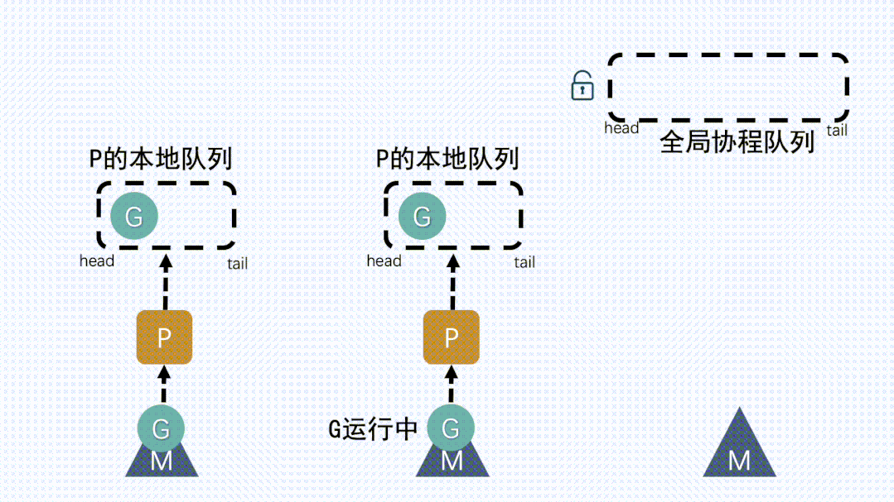
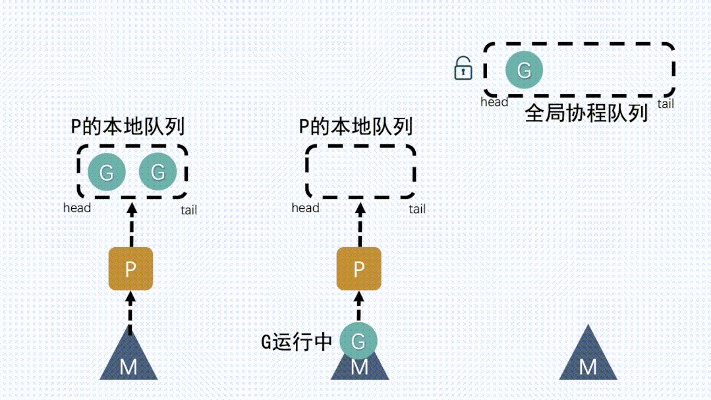

# 协程调度GRM模型

## 线程调度

### 早期单线程操作系统

- 一切的软件都是跑在操作系统上，真正用来干活(计算)的是CPU。
- 早期的操作系统每个程序就是一个进程，知道一个程序运行完，才能进行下一个进程，就是“单进程时代”
- 一切的程序只能串行发生。

### 多进程/线程时代

- 在多进程/多线程的操作系统中，就解决了阻塞的问题，因为一个进程阻塞cpu可以立刻切换到其他进程中去执行
- 而且调度cpu的算法可以保证在运行的进程都可以被分配到cpu的运行时间片
- 这样从宏观来看，似乎多个进程是在同时被运行。
- 但新的问题就又出现了，进程拥有太多的资源，进程的创建、切换、销毁，都会占用很长的时间
- CPU虽然利用起来了，但如果`进程过多，CPU有很大的一部分都被用来进行进程调度了`
- 大量的进程/线程出现了新的问题
  - 高内存占用
  - 调度的高消耗CPU
  - 进程虚拟内存会占用4GB[32位操作系统], 而线程也要大约4MB

### Go协程goroutine

- Go中，协程被称为goroutine，它非常轻量，一个goroutine只占几KB，并且这几KB就足够goroutine运行完
- 这就能在有限的内存空间内支持大量goroutine，支持了更多的并发
- 虽然一个goroutine的栈只占几KB，但实际是可伸缩的，如果需要更多内容，`runtime`会自动为goroutine分配。
- Goroutine特点：
  - 占用内存更小（几kb）
  - 调度更灵活(runtime调度)

### 协程与线程区别

- 协程跟线程是有区别的，线程由CPU调度是抢占式的
- **协程由用户态调度是协作式的**，一个协程让出CPU后，才执行下一个协程

## 调度器GMP模型

- G：goroutine（协程）
- M：thread（内核线程，不是用户态线程）
- P：processer（调度器）

### GM模型

- `G（协程）`，通常在代码里用 `go` 关键字执行一个方法，那么就等于起了一个`G`。
- `M（内核线程）`，操作系统内核其实看不见`G`和`P`，只知道自己在执行一个线程。
- `G`和`P`都是在**用户层**上的实现。
- 并发量小的时候还好，当并发量大了，这把大锁，就成为了**性能瓶颈**。

- GPM由来
  - 基于没有什么是加一个中间层不能解决的思路，`golang`在原有的`GM`模型的基础上加入了一个调度器`P`
  - 可以简单理解为是在`G`和`M`中间加了个中间层
  - 于是就有了现在的`GMP`模型里的P

### GMP模型

## GPM流程分析

- 我们通过 go func()来创建一个goroutine；

### P本地队列获取G

- M`想要运行`G`，就得先获取`P`，然后从`P`的本地队列获取`G

### 本地队列中G移动到全局队列

- 新建 `G` 时，新`G`会优先加入到 `P` 的本地队列；
- 如果本地队列满了，则会把本地队列中一半的 `G` 移动到全局队列

### 从其他P本地队列的G放到自己P队列

- 如果全局队列为空时，`M` 会从其他 `P` 的本地队列**偷（stealing）一半G**放到自己 `P` 的本地队列。

### M从P获取下一个G，不断重复

- `M` 运行 `G`，`G` 执行之后，`M` 会从 `P` 获取下一个 `G`，不断重复下去

