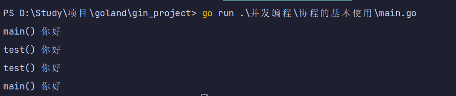
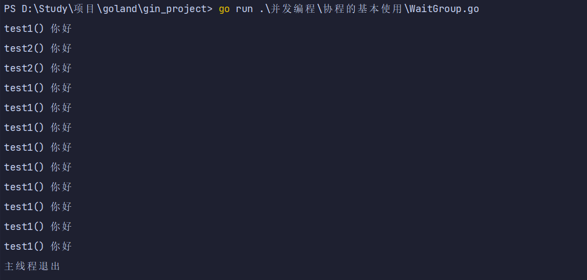
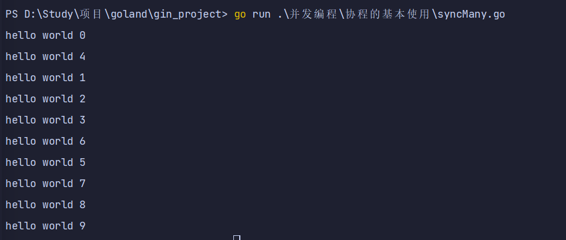
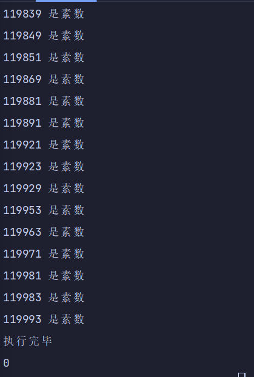

# 协程基本使用

## 协程基本使用

### 启动一个协程

* 主线程中每个100毫秒打印一次，总共打印2次
* 另外开启一个协程，打印10次
* 情况一：打印是交替，证明是并行的
* 情况二：开启的协程打印两次，就退出了（因为主线程退出了）

```go
package main

import (
	"fmt"
	"time"
)

func main() {
	go test() //表示开启一个协程
	for i := 0; i < 2; i++ {
		fmt.Println("main() 你好")
		time.Sleep(time.Millisecond * 100)
	}
}

func test() {
	for i := 0; i < 10; i++ {
		fmt.Println("test() 你好")
		time.Sleep(time.Millisecond * 100)
	}
}

```



### WaitGroup等待协程执行完毕

* 主线程退出后所有的协程无论有没有执行完毕都会退出

* 所以我们在主进程中可以通过WaitGroup等待协程执行完毕

  * sync.WaitGroup内部维护着一个计数器，计数器的值可以增加和减少。

  * 例如当我们启动了N 个并发任务时，就将计数器值增加N。

  * 每个任务完成时通过调用Done\(\)方法将计数器减1。

  * 通过调用Wait\(\)来等待并发任务执行完，当计数器值为0时，表示所有并发任务已经完成。

  * ```go
       var wg sync.WaitGroup       // 第一步：定义一个计数器
       wg.Add(1)               // 第二步：开启一个协程计数器+1
       wg.Done()               // 第三步：协程执行完毕，计数器-1
       wg.Wait()               // 第四步：计数器为0时推出
    ```

```go
package main

import (
	"fmt"
	"sync"
	"time"
)

var wg sync.WaitGroup // 第一步：定义一个计数器

func test1() {
	for i := 0; i < 10; i++ {
		fmt.Println("test1() 你好")
		time.Sleep(time.Millisecond * 100)
	}
	wg.Done() //协程计数器-1   第三步：协程执行完毕，计数器-1

}

func test2() {
	for i := 0; i < 2; i++ {
		fmt.Println("test2() 你好")
		time.Sleep(time.Millisecond * 100)
	}
	wg.Done() //协程计数器-1

}

func main() {
	wg.Add(1)  //协程计数器+1       第二步：开启一个协程计数器+1
	go test1() //表示开启一个协程
	wg.Add(1)  //协程计数器+1
	go test2() //表示开启一个协程
	wg.Wait()  //等待协程执行完毕...   第四步：计数器为0时推出
	fmt.Println("主线程退出")
}

```



## 多携程案例

### 开启多个协程

* 在 Go 语言中实现并发就是这样简单，我们还可以启动多个 goroutine。
* 这里使用了 sync.WaitGroup 来实现等待 goroutine 执行完毕
* 多次执行上面的代码，会发现每次打印的数字的顺序都不一致。
* 这是因为 10 个 goroutine是并发执行的，而 goroutine 的调度是随机的。

```go
package main

import (
	"fmt"
	"sync"
)

var wg1 sync.WaitGroup

func hello(i int) {
	defer wg1.Done() // goroutine结束就登记-1
	fmt.Println("hello world", i)
}

func main() {
	for i := 0; i < 10; i++ {
		wg1.Add(1) // 启动一个goroutine就登记+1
		go hello(i)
	}
	wg1.Wait() // 等待所有登记的goroutine都结束
}

```



### 多协程统计素数

* 需求：要统计1-120000的数字中那些是素数？goroutine for循环实现
* 1 协程 统计 1-30000
* 2 协程 统计 30001-60000
* 3 协程 统计 60001-90000
* 4 协程 统计 90001-120000
* `start:(n-1)*30000+1 end:n*30000`

```go
package main

import (
	"fmt"
	"sync"
	"time"
)

var wg2 sync.WaitGroup

func test3(n int) {
	for num := (n-1)*30000 + 1; num < n*30000; num++ {
		if num > 1 {
			var flag = true
			for i := 2; i < num; i++ {
				if num%i == 0 {
					flag = false
					break
				}
			}
			if flag {
				fmt.Println(num, "是素数")
			}
		}
	}
	wg2.Done()
}

func main() {
	start := time.Now().Unix()
	for i := 1; i <= 4; i++ {
		wg2.Add(1)
		go test3(i)
	}
	wg2.Wait()
	fmt.Println("执行完毕")
	end := time.Now().Unix()
	fmt.Println(end - start)
}

```



