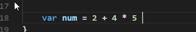

# Go 规范的代码风格&语言的转义字符(escape char) 

## 说明:常用的转义字符有如下 

1) \t : 表示一个制表符，通常使用它可以排版。尚硅谷 Go 语言课程 


2) \n ：换行符 

3) \\ 

：一个\ 

4) \" ：一个" 

5) \r 

：一个回车 fmt.Println("天龙八部雪山飞狐\r 张飞"); 

6) 案例截图 


## 规范的代码风格 

2.12.1 正确的注释和注释风格： 

1) Go 官方推荐使用行注释来注释整个方法和语句。 

2) 带看 Go 源码 

2.12.2 正确的缩进和空白 

1) 使用一次 **tab** **操作**，实现缩进,默认整体向右边移动，时候用 **shift+tab** 整体向左移 

看老师的演示： 

2) 或者使用 gofmt 来进行格式化 [演示]


3) 运算符两边习惯性各加一个空格。比如：2 + 4 * 5。 



4) Go 语言的代码风格. 

```go
package main 

import "fmt" 

func main() { 

fmt.Println("hello,world!") 

}
```

上面的写法是正确的. 

```go
package main 

import "fmt" 

func main() 
{

fmt.Println("hello,world!")

}
```

上面的写法不是正确，Go 语言不允许这样编写。 【Go 语言不允许这样写，是错误的！】 

Go 设计者思想: **一个问题尽量只有一个解决方法** 

5) 一行最长不超过 80 个字符，超过的请使用换行展示，尽量保持格式优雅 

 举例说明 

