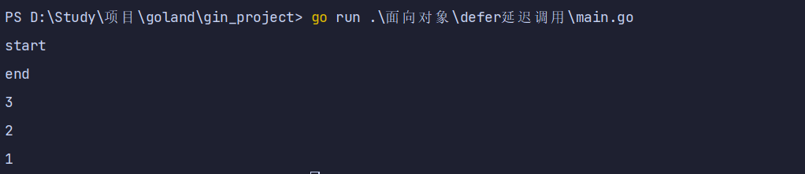
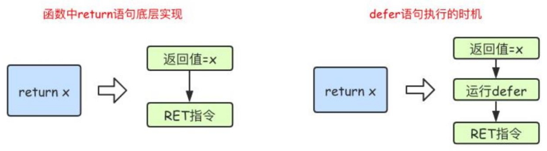
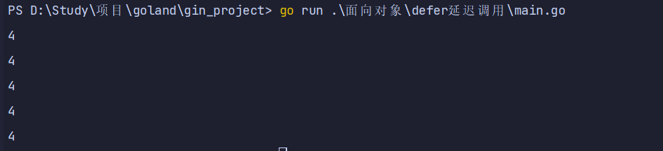

# defer延时调用

## defer介绍

### defer特性

- 1.关键字defer用于注册延迟调用。
- 2.这些调用直到return前才被执。因此，可以用来做资源清理。
- 3.多个defer语句，按先进后出的方式执行。
- 4.defer语句中的变量，在defer声明时就决定了。

### defer用途

- 1.关闭文件句柄
- 2.锁资源释放
- 3.数据库连接释放

### defer语句使用说明

- defer实现类似于栈，先进后出
- 而且是在函数执行完成到return返回之间调用

```go
package main

import "fmt"

func main() {
	fmt.Println("start")
	defer fmt.Println(1)
	defer fmt.Println(2)
	defer fmt.Println(3)
	fmt.Println("end")
}

```



### defer 执行时机

- 在 Go 语言的函数中 return 语句在底层并不是原子操作，它分为给返回值赋值和 RET 指令两步。
- 而 defer 语句执行的时机就在返回值赋值操作后，RET 指令执行前。
- 具体如下图所示：



### defer案例

- defer 注册要延迟执行的函数时该函数所有的参数都需要确定其值

```go
package main

import "fmt"

func calc(index string, a, b int) int {
	ret := a + b
	fmt.Println(index, a, b, ret)
	return ret
}

func main() {
	var x, y int
	defer calc("AA", x, calc("A", x, y))
	x = 10
	defer calc("BB", x, calc("B", x, y))
	y = 10
}

```


## defer陷阱

### defer 碰上闭包

- 也就是说函数正常执行,由于闭包用到的变量 i 在执行的时候已经变成4,所以输出全都是4

```go
package main

import "fmt"

func main() {
	var whatever [5]struct{}
	for i := range whatever {
		defer func() {
			fmt.Println(i)
		}()
	}
}

```

