# 函数

## 函数基础

### 函数定义

* 函数是组织好的、可重复使用的、用于执行指定任务的代码块。
* 本文介绍了 Go 语言中函数的相关内容。
* Go 语言中支持：函数、匿名函数和闭包

```go
package main

import "fmt"

func inSum(a, b int) int {
    return a + b
}

func main() {
    ret := inSum(1, 2)
    fmt.Println(ret)
}
```

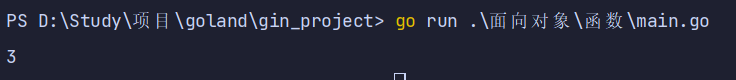

### 可变参数

* 可变参数是指函数的参数数量不固定。
* Go 语言中的可变参数通过在参数名后加...来标识。
* 注意：可变参数通常要作为函数的最后一个参数。

```go
package main

import "fmt"

func inSum2(a string, x ...int) int {
    fmt.Println(a) // zs
    fmt.Println(x) // x是一个切片 = [1, 2]
    sum := 0
    for _, i := range x {
        sum += i
    }
    return sum
}

func main() {
    str := "zs"
    ret := inSum2(str, 1, 2)
    fmt.Println(ret)
}
```

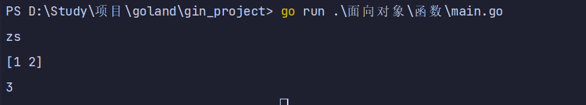

### 函数返回值

* Go 语言中通过 return 关键字向外输出返回值。
* 函数多返回值，Go 语言中函数支持多返回值，函数如果有多个返回值时必须用\(\)将所有返回值包裹起来

```go
package main

import "fmt"

func calc(a, b int) (int, int) {
    var sum = a + b
    var sub = a - b
    return sum, sub

}

func main() {
    sum, sub := calc(1, 2)
    fmt.Println(sum, sub)
}
```


### 函数类型与变量

* 定义函数类型，我们可以使用 type 关键字来定义一个函数类型
* 具体格式如下：

```go
type calculation func(int, int) int
```

* 上面语句定义了一个 calculation 类型，它是一种函数类型，这种函数接收两个 int 类型的参数并且返回一个 int 类型的返回值。
* 简单来说，凡是满足这个条件的函数都是 calc 类型的函数，例如下面的 add 和 sub 是calculation 类型。

```go
package main

import "fmt"

func inSum(a, b int) int {
    return a + b
}

type test func(int, int) int

func main() {
    var t test // 声明一个 test 类型的变量 t
    t = inSum  // 把 inSum 赋值给 t
    fmt.Println(t(1, 3))
    fmt.Printf("type of t:%T\n", t)
}
```

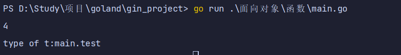

## 函数变量作用域

### 全局变量

* 全局变量是定义在函数外部的变量，它在程序整个运行周期内都有效。
* 在函数中可以访问到全局变量

```go
package main

import "fmt"

const age int = 998

func main() {
    fmt.Printf("type of age:%T  value: %[1]v \n", age)
}
```

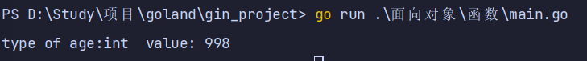

### 局部变量

* 局部变量是函数内部定义的变量， 函数内定义的变量无法在该函数外使用
* 例如下面的示例代码 main 函数中无法使用 testLocalVar 函数中定义的变量 x

```go
package main

import "fmt"

func test2() {
    name := "张三"
    fmt.Println(name)
}

func main() {
    //fmt.Printf("type of age:%T  value: %[1]v \n", name)

}
```

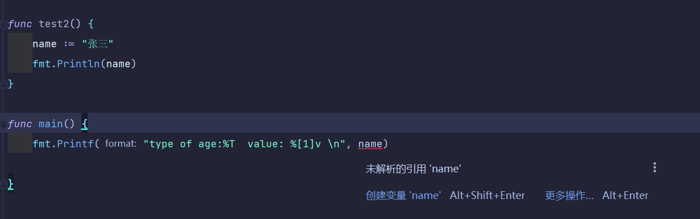

### 语句块定义的变量

* 接下来我们来看一下语句块定义的变量，通常我们会在 if 条件判断、for 循环、switch 语句上使用这种定义变量的方式

```go
package main

import "fmt"

func test3(x, y int) {
    fmt.Println(x, y) //函数的参数也是只在本函数中生效
    if x < y {
        z := 9 // 变量 z 只在 if 语句块生效
        fmt.Println(z)
    }
    //fmt.Println(z)
}

func main() {
    test3(3, 8)
}
```

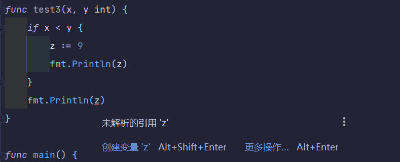

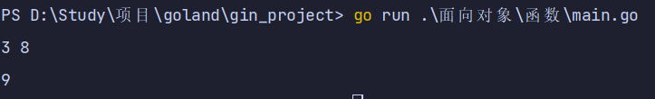

### for 循环语句中定义的变量

* 我们之前讲过的 for 循环语句中定义的变量，也是只在 for 语句块中生效

```go
package main

import "fmt"

func forTest() {
    for i := 0; i < 10; i++ {
        fmt.Println(i)
    }
    //fmt.Println(i)
}

func main() {
    forTest()
}
```

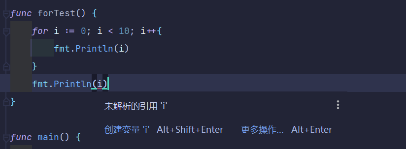

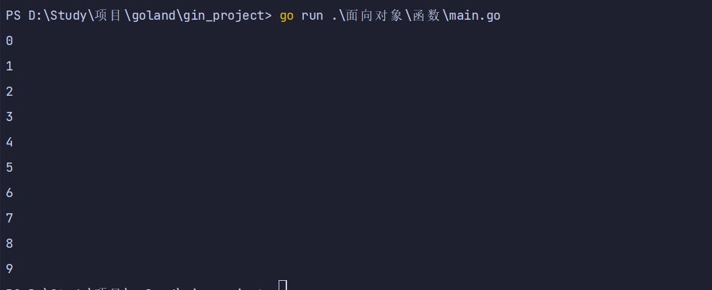

## 高阶函数

* 高阶函数分为函数作为参数和函数作为返回值两部分。
* 函数作为参数，函数也可以作为返回值

```go
package main

import "fmt"

func add(x, y int) int {
    return x + y
}

func sub(x, y int) int {
    return x - y
}

func do(s string) func(int, int) int {
    switch s {
    case "+":
        return add
    case "-":
        return sub
    default:
        return nil
    }
}

func main() {
    a := do("+")
    b := do("-")
    fmt.Println(a(1, 3))
    fmt.Println(b(1, 3))
}
```

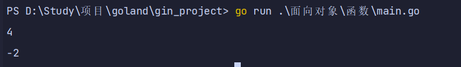

## 匿名函数

* 匿名函数由一个不带函数名的函数声明和函数体组成。
* 匿名函数的优越性在于可以直接使用函数内的变量，不必申明。
* 匿名函数因为没有函数名，所以没办法像普通函数那样调用，所以匿名函数需要保存到某个变量或者作为立即执行函数
* 匿名函数多用于实现回调函数和闭包

```go
package main

import "fmt"

func main() {
    // 一：匿名函数  匿名自执行函数
    func() {
        fmt.Println("test")
    }()
    // 二：匿名函数
    var fn = func(a, b int) int {
        return a + b
    }
    fmt.Println(fn(1, 2))
    // 三：匿名函数 自动执行 接收参数
    func(x, y int) {
        fmt.Println(x, y)
    }(10, 20)

}
```

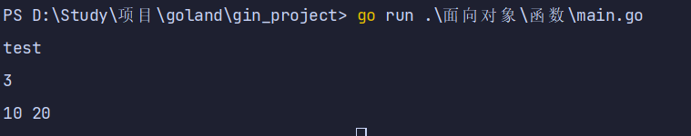

## 闭包

### 闭包的概念

* 闭包可以理解成“定义在一个函数内部的函数“。
* 在本质上，闭包是将函数内部和函数外部连接起来的桥梁。
* 举例：
  * 变量 f 是一个函数并且它引用了其外部作用域中的 x 变量，此时 f 就是一个闭包。
  * 在 f 的生命周期内，变量 x 也一直有效。

```go
package main

import "fmt"

func adder() func(int) int {
    var x int
    return func(y int) int {
        x += y
        return x
    }
}

func main() {
    var f = adder()
    fmt.Println(f(10))
    fmt.Println(f(20))
    fmt.Println(f(30))

    f1 := adder()
    fmt.Println(f1(30))
    fmt.Println(f1(30))

}
```

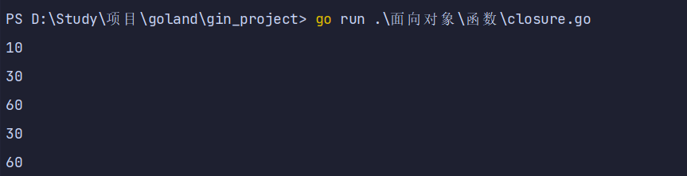

### 闭包变量作用域

* 全局变量特点：
  * 1、常驻内存
  * 2、污染全局
* 局部变量的特点：
  * 1、不常驻内存
  * 2、不污染全局
* 闭包：
  * 1、可以让一个变量常驻内存
  * 2、可以让一个变量不污染全局
* 闭包
  * 1、闭包是指有权访问另一个函数作用域中的变量的函数。
  * 2、创建闭包的常见的方式就是在一个函数内部创建另一个函数，通过另一个函数访问这个函数的局部变量。
* 注意：
  * 由于闭包里作用域返回的局部变量资源不会被立刻销毁回收，所以可能会占用更多的内存。
  * 过度使用闭包会导致性能下降，建议在非常有必要的时候才使用闭包。

### 闭包的三种形式

#### 闭包进阶示例 1

```go
package main

import "fmt"

func adder2(x int) func(int) int {
    return func(y int) int {
        x += y
        return x
    }

}

func main() {
    f1 := adder2(2)
    fmt.Println(f1(30))
    fmt.Println(f1(30))

}
```

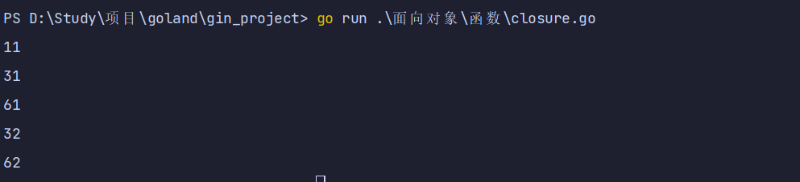

### 闭包进阶示例 2

```go
package main

import (
    "fmt"
    "strings"
)
func makeSuffixFunc(suffix string) func(string2 string) string {

    return func(name string) string {
        // 判断 name 是否以 suffix 结尾
        // 判断 name 是否以 suffix 结尾
        if !strings.HasSuffix(name, suffix) {
            return name + suffix
        }
        return name
    }

}

func main() {
    jpg := makeSuffixFunc(".jpg")
    txt := makeSuffixFunc(".txt")
    fmt.Println(jpg("test"))
    fmt.Println(txt("test.txt"))

}
```

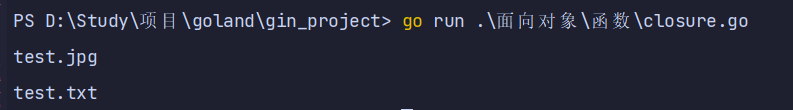

### 闭包进阶示例 3

```go
package main

import (
    "fmt"
)

func calcTest(base int) (func(int) int, func(int) int) {
    add := func(i int) int {
        base += i
        return base
    }
    sub := func(i int) int {
        base -= i
        return base
    }
    return add, sub

}

func main() {
    f1, f2 := calcTest(2)
    fmt.Println(f1(1), f2(1))
}
```

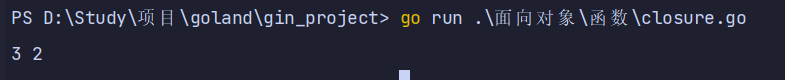

