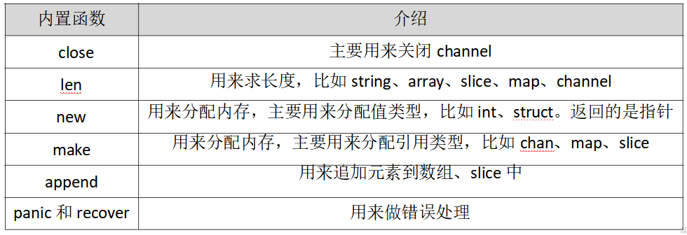
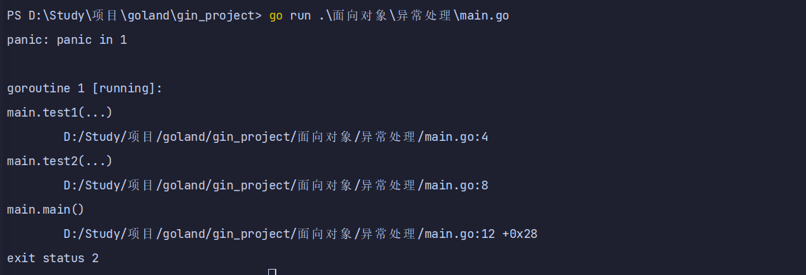
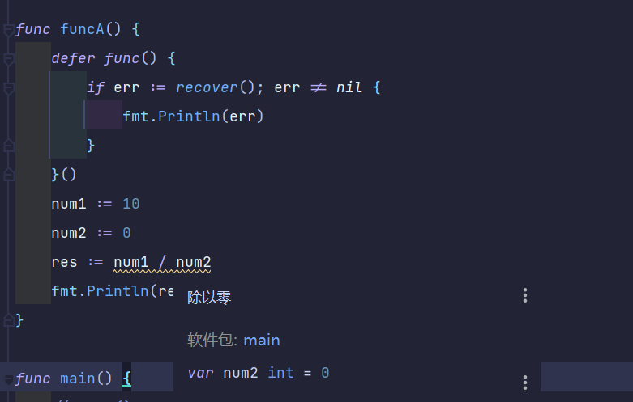
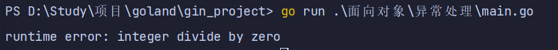
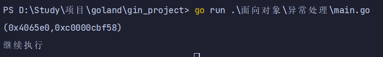
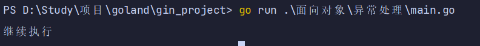

# 异常处理

## 异常处理介绍

### go中异常处理介绍

* Golang 没有结构化异常，使用 panic 抛出错误，recover 捕获错误。
* Go中可以抛出一个panic的异常，然后在defer中通过recover捕获这个异常，然后正常处理。
* panic可以在任何地方引发，但 recover 只有在 defer 调用的函数中有效。



### panic

* 1、内置函数
* 2、假如函数F中书写了panic语句，会终止其后要执行的代码，在panic所在函数F内如果存在要执行的defer函数列表，按照defer的逆序执行
* 3、返回函数F的调用者G，在G中，调用函数F语句之后的代码不会执行，假如函数G中存在要执行的defer函数列表，按照defer的逆序执行
* 4、直到goroutine整个退出，并报告错误

### recover

* 1、内置函数
* 2、用来控制一个goroutine的panicking行为，捕获panic，从而影响应用的行为
* 3、一般的调用建议
  * a\). 在defer函数中，通过recever来终止一个goroutine的panicking过程，从而恢复正常代码的执行
  * b\). 可以获取通过panic传递的error

### 注意

* 利用recover处理panic指令，defer 必须放在 panic 之前定义，另外 recover 只有在 defer 调用的函数中才有效。
* 否则当panic时，recover无法捕获到panic，无法防止panic扩散。
* recover 处理异常后，逻辑并不会恢复到 panic 那个点去，函数跑到 defer 之后的那个点。
* 多个 defer 会形成 defer 栈，后定义的 defer 语句会被最先调用。

## panic/recover异常处理

### panic触发程序奔溃

* 程序运行期间 funcB 中引发了 panic 导致程序崩溃，异常退出了。
* 这个时候我们就可以通过recover 将程序恢复回来，继续往后执行。

```go
package main

func test1() {
	panic("panic in 1")
}

func test2() {
	test1()
}

func main() {
	test2()
}

```



### defer 、recover 实现异常处理

* recover\(\)必须搭配 defer 使用
* defer 一定要在可能引发 panic 的语句之前定义

```go
package main

import "fmt"

func funcA() {
	defer func() {
		if err := recover(); err != nil {
			fmt.Println(err)
		}
	}()
	num1 := 10
	num2 := 0
	res := num1 / num2
	fmt.Println(res)
}

func main() {
	funcA()
}

```





### defer 、panic、recover 抛出异常

```go
package main

import (
	"errors"
	"fmt"
)

func readFile(fileName string) error {
	if fileName == "main.go" {
		return nil
	}
	return errors.New("读取文件错误")
}

func main() {
	defer func() {
		if err := recover(); err != nil {
			fmt.Println(err)
		}
	}()

	var err = readFile("xxx.go")
	if err != nil {
		println(err)
	}
	fmt.Println("继续执行")

}

```



参数替换为 `main.go`

