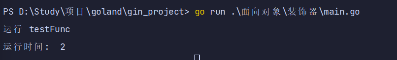
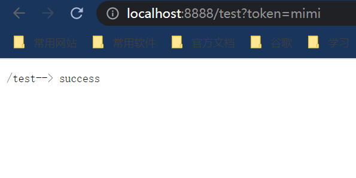
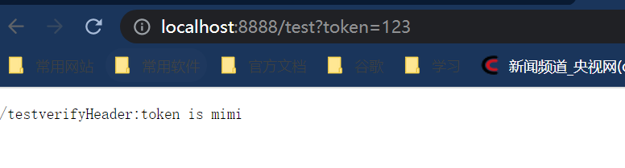

# 装饰器

## golang装饰器

### 简单timer装饰器

```go
package main

import (
	"fmt"
	"time"
)

func timer(fn func()) func() {
	return func() {
		startTime := time.Now().Unix()
		fn()
		endTime := time.Now().Unix()
		fmt.Println("运行时间: ", endTime-startTime)
	}
}

func testFunc() {
	fmt.Println("运行 testFunc")
	time.Sleep(time.Second * 2)
}

func main() {
	test := timer(testFunc)
	test()
}

```



### 项目中认证实现

```go
package main

import (
	"fmt"
	"log"
	"net/http"
)

type DecoratorHandler func(handlerFunc http.HandlerFunc) http.HandlerFunc

func middlewareHandlerFunc(hp http.HandlerFunc, decors ...DecoratorHandler) http.HandlerFunc {
	for _, fn := range decors {
		dp := fn
		hp = dp(hp)
	}
	return hp
}

func verifyHeader(h http.HandlerFunc) http.HandlerFunc {
	return func(w http.ResponseWriter, request *http.Request) {
		token := request.URL.Query().Get("token")
		if token == "" {
			fmt.Fprintf(w, request.URL.Path+"verifyHeader:token is null")
			return
		}
		h(w, request)
	}
}

func verifyHeader2(h http.HandlerFunc) http.HandlerFunc {
	return func(w http.ResponseWriter, request *http.Request) {
		token := request.URL.Query().Get("token")
		if token != "mimi" {
			fmt.Fprintf(w, request.URL.Path+"verifyHeader:token is mimi")
			return
		}
		h(w, request)
	}
}

func Pong(w http.ResponseWriter, request *http.Request) {
	fmt.Fprintf(w, request.URL.Path+"--> success")
}

func main() {
	http.HandleFunc("/test", middlewareHandlerFunc(Pong, verifyHeader, verifyHeader2))
	err := http.ListenAndServe(":8888", nil)
	if err != nil {
		log.Fatal("ListenAndServe:", err)
	}
}

```



