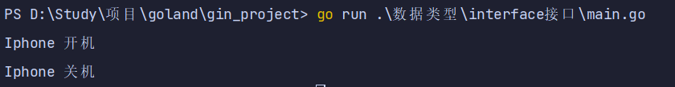
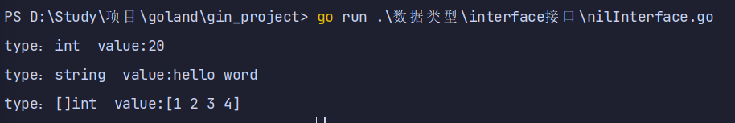
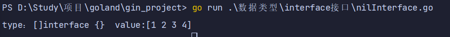
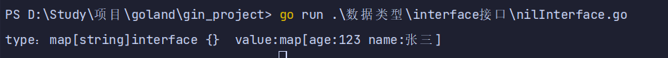
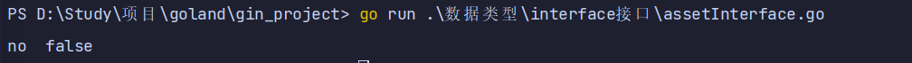
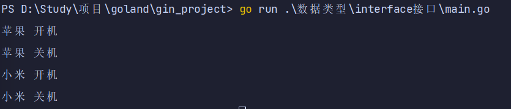
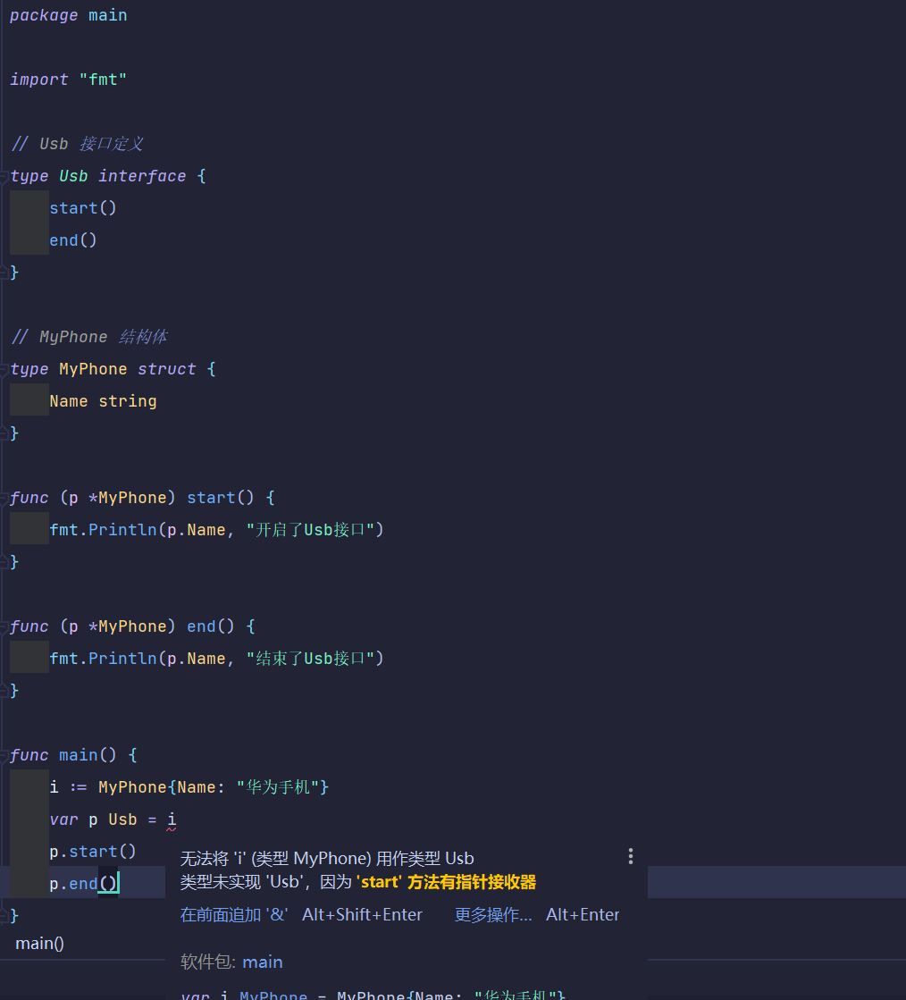
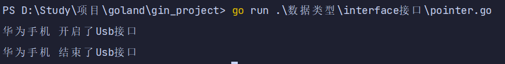
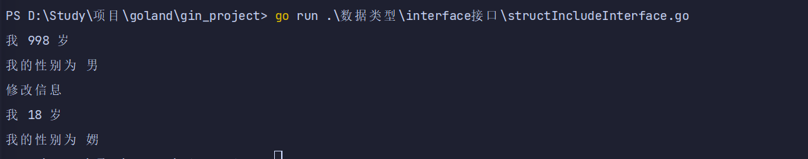
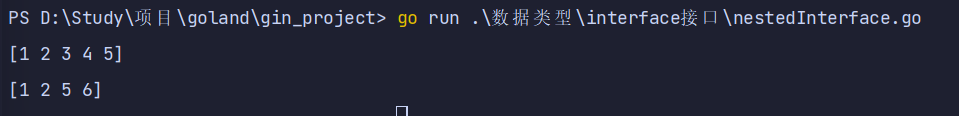

# interface接口

## Golang接口的定义

### Golang 中的接口

* 在Go语言中接口（interface）是一种类型，一种抽象的类型。
* 接口（interface）定义了一个对象的行为规范，只定义规范不实现，由具体的对象来实现规范的细节。
* 实现接口的条件
  * 一个对象只要全部实现了接口中的方法，那么就实现了这个接口。
  * 换句话说，接口就是一个需要实现的方法列表。

### 定义一个Usber接口

* 定义一个 **Usber** 接口让 **Phone** 和 **Camera** 结构体实现这个接口

```go
package main

import "fmt"

// User 接口是一个规范
type User interface {
    start()
    end()
}

// Phone 如果接口里面有方法的话，必要要通过结构体或者通过自定义类型实现这个接口
type Phone struct {
    Name string
}

// 手机实现开机方法
func (p Phone) start() {
    fmt.Println(p.Name, "开机")
}

// 手机实现关机方法
func (p Phone) end() {
    fmt.Println(p.Name, "关机")
}

func main() {
    p := Phone{Name: "Iphone"}
    var p1 User // golang中接口就是一个数据类型
    p1 = p      // 表示获取手机数据
    p1.start()
    p1.end()

}
```



## 空接口

### 空接口说明

* `golang中空接口也可以直接当做类型来使用，可以表示任意类型`
* Golang 中的接口可以不定义任何方法，没有定义任何方法的接口就是空接口。
* 空接口表示没有任何约束，因此任何类型变量都可以实现空接口。
* 空接口在实际项目中用的是非常多的，用空接口可以表示任意数据类型。

### 空接口作为函数的参数

```go
package main

import "fmt"

//空接口作为函数的参数
func show(a interface{}) {
    fmt.Printf("type：%T  value:%[1]v \n", a)
}

func main() {
    show(20)
    show("hello word")
    slice := []int{1, 2, 3, 4}
    show(slice)
}
```



### 切片实现空接口

```go
package main

import "fmt"

func main() {
    var slice = []interface{}{1, 2, 3, 4}
    fmt.Printf("type：%T  value:%[1]v \n", slice)
}
```



### map 的值实现空接口

```go
package main

import "fmt"

func main() {
    // 空接口作为 map 值
    var aMap = make(map[string]interface{})
    aMap["age"] = 123
    aMap["name"] = "张三"
    fmt.Printf("type：%T  value:%[1]v \n", aMap)
}
```



## 类型断言

* 一个接口的值（简称接口值）是由一个具体类型和具体类型的值两部分组成的。
* 这两部分分别称为接口的动态类型和动态值。
* 如果我们想要判断空接口中值的类型，那么这个时候就可以使用类型断言
* 其语法格式：`x.(T)`
  * x : 表示类型为 interface{}的变量
  * T : 表示断言 x 可能是的类型

```go
package main

import "fmt"

func main() {
    var x interface{}
    x = 123
    v, ok := x.(string)
    if ok {
        fmt.Println("ok", v, ok)
    } else {
        fmt.Println("no", v, ok)
    }
}
```



## 值接收者和指针接收者

### 值接收者

* 如果结构体中的方法是值接收者，那么实例化后的结构体值类型和结构体指针类型都可以赋值给接口变量

```go
package main

import "fmt"

// User 接口是一个规范
type User interface {
    start()
    end()
}

// Phone 如果接口里面有方法的话，必要要通过结构体或者通过自定义类型实现这个接口
type Phone struct {
    Name string
}

// 手机实现开机方法
func (p Phone) start() {
    fmt.Println(p.Name, "开机")
}

// 手机实现关机方法
func (p Phone) end() {
    fmt.Println(p.Name, "关机")
}

func main() {
    //p := Phone{Name: "Iphone"}
    //var p1 User // golang中接口就是一个数据类型
    //p1 = p      // 表示获取手机数据
    //p1.start()
    //p1.end()

    i := Phone{Name: "苹果"}
    var p1 User = i //苹果 实现了 开关机 接口 p1 是 Phone 类型
    p1.start()
    p1.end()

    m := &Phone{Name: "小米"}
    var p2 User = m //小米 实现了 开关机 接口 p2 是 *Phone 类型
    p2.start()
    p2.end()

}
```



### 指针接收者

* 如果结构体中的方法是指针接收者，那么实例化后结构体指针类型都可以赋值给接口变量，`结构体值类型没法赋值给接口变量`。

```go
package main

import "fmt"

// Usb 接口定义
type Usb interface {
    start()
    end()
}

// MyPhone 结构体
type MyPhone struct {
    Name string
}

func (p *MyPhone) start() {
    fmt.Println(p.Name, "开启了Usb接口")
}

func (p *MyPhone) end() {
    fmt.Println(p.Name, "结束了Usb接口")
}

func main() {
    // 错误写法
    //i := MyPhone{Name: "华为手机"}
    //var p Usb = i
    //p.start()
    //p.end()

    // 正确写法
    i := MyPhone{Name: "华为手机"}
    var p Usb = &i
    p.start()
    p.end()
}
```





## 一个结构体实现多个接口

* Golang 中一个结构体也可以实现多个接口

```go
package main

import "fmt"

// Age 我的年龄
type Age interface {
    MyAge()
}

// Sex 我的性别
type Sex interface {
    MySex()
}

// SetAgeAndSex 修改我的信息
type SetAgeAndSex interface {
    SetMyInfo(*string, *int)
}

// My 我的信息
type My struct {
    Sex string
    Age int
}

// SetMyInfo 修改我的信息
func (m *My) SetMyInfo(s *string, a *int) {
    m.Sex = *s
    m.Age = *a
    fmt.Println("修改信息")
}

// MySex 我的性别
func (m My) MySex() {
    fmt.Println("我的性别为", m.Sex)
}

// MyAge 我的年龄
func (m *My) MyAge() {
    fmt.Println("我", m.Age, "岁")
}

func main() {
    // 初始化我的信息
    my := &My{
        Sex: "男",
        Age: 998,
    }
    var age Age = my
    var sex Sex = my
    // 输出我的信息
    age.MyAge()
    sex.MySex()
    // 获取我的信息
    var setInfo SetAgeAndSex = my
    s := "娚"
    a := 18
    // 修改我的信息
    setInfo.SetMyInfo(&s, &a)
    age.MyAge()
    sex.MySex()

}
```



## 接口嵌套

* 接口与接口间可以通过嵌套创造出新的接口。

```go
package main

import "fmt"

type Append interface {
    add()
}

type Delete interface {
    pop()
}

// SliceMethod 接口嵌套
type SliceMethod interface {
    Append
    Delete
}

// Slice 创建切片
type Slice []int

// 给切片添加元素
func (s *Slice) add() {
    *s = append(*s, 6)
}

// 给切片删除元素
func (s *Slice) pop() {
    *s = append((*s)[:2], (*s)[4:]...)
}

func run() *Slice {
    // 初始化数据
    s := &Slice{1, 2, 3, 4, 5}
    fmt.Println(*s)
    // 接口赋值
    var sm SliceMethod = s
    // 执行添加/删除方法
    sm.add()
    sm.pop()
    return s
}

func main() {
    s := run()
    fmt.Println(*s)
}
```



