# 结构体

## 结构体基础

### 什么是结构体

* Go语言中没有“类”的概念，也不支持“类”的继承等面向对象的概念。
* Go语言中通过结构体的内嵌再配合接口比面向对象具有更高的扩展性和灵活性。

### 自定义类型

* 在 Go 语言中有一些基本的数据类型，如 string、整型、浮点型、布尔等数据类型
* Go 语言中可以使用 type 关键字来定义自定义类型。
* 将 myInt 定义为 int 类型，通过 type 关键字的定义，myInt 就是一种新的类型，它具有 int 的特性

```go
type myInt int
```

### 类型别名

* Golang1.9 版本以后添加的新功能。
* **类型别名规定**：TypeAlias 只是 Type 的别名，本质上 TypeAlias 与 Type 是同一个类型
* 就像 一个孩子小时候有大名、小名、英文名，但这些名字都指的是他本人。

```go
type TypeAlias = Type
```

### 自定义类型和类型别名的区别

* 类型别名与自定义类型表面上看只有一个等号的差异
* 结果显示 a 的类型是 main.newInt，表 示 main 包下定义的 newInt 类型。
* b 的类型是 int 类型。

```go
package main

import "fmt"

type name string // 类型定义
type age = int   // 类型别名

func main() {
    var a_name name
    a_name = "张三"
    var a_age age
    a_age = 11
    fmt.Printf("type: %T  value:%[1]s \n", a_name)
    fmt.Printf("type: %T  value:%[1]v \n", a_age)

}
```

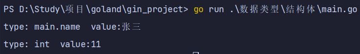

## 结构体定义

### 基本实例化（法1）

* 只有当结构体实例化时，才会真正地分配内存，也就是必须实例化后才能使用结构体的字段。
* 结构体本身也是一种类型，我们可以像声明内置类型一样使用 var 关键字声明结构体类型

```go
package main

import "fmt"

type person struct {
    name string
    age  int
    sex  string
}

func main() {
    var p1 person
    p1.name = "张三"
    p1.age = 15
    p1.sex = "男"
    fmt.Printf("type:%T  value:%[1]v \n", p1)
    fmt.Printf("type:%T  value:%#[1]v \n", p1)
}
```

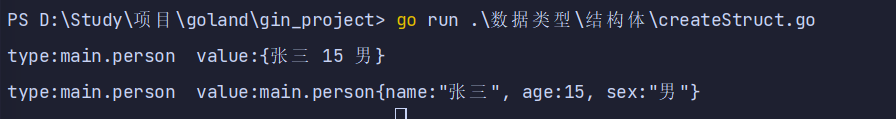

### new实例化（法2）

* 我们还可以通过使用 new 关键字对结构体进行实例化，得到的是结构体的地址
* 从打印的结果中我们可以看出 p2 是一个结构体指针。
* 注意：在 Golang 中支持对结构体指针直接使用.来访问结构体的成员。
* `p2.name = "张三"` 其实在底层是 `(*p2).name = "张三"`

```go
package main

import "fmt"

type person2 struct {
    name string
    age  int
    sex  string
}

func main() {
    var p1 = new(person2)
    p1.name = "zs"
    p1.age = 111
    p1.sex = "女"
    fmt.Printf("type:%T value:%[1]v", p1)
    fmt.Printf("type:%T value:%#[1]v", p1)
}
```

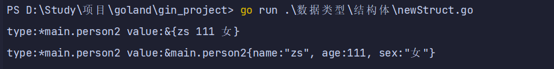

### &取地址实例化（法3）

* 使用&对结构体进行取地址操作相当于对该结构体类型进行了一次 new 实例化操作

```go
package main

import "fmt"

type person2 struct {
    name string
    age  int
    sex  string
}

func main() {
    var p1 = &person2{
        name: "张三",
        age:  55,
        sex:  "中",
    }
    (*p1).age = 40 //这样也是可以的
    fmt.Printf("type:%T value:%[1]v \n", p1)
    fmt.Printf("type:%T value:%#[1]v \n", p1)
}
```

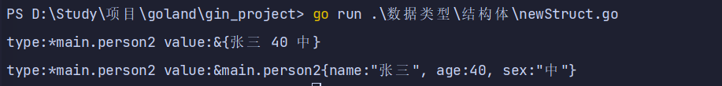

### 键值对初始化（法4）

* 注意：最后一个属性的,要加上`,`

```go
package main

import "fmt"

type person2 struct {
    name string
    age  int
    sex  string
}

func main() {
    p1 := person2{
        name: "张三",
        age:  55,
        sex:  "中",
    }
    fmt.Printf("type:%T value:%[1]v \n", p1)
    fmt.Printf("type:%T value:%#[1]v \n", p1)

}
```

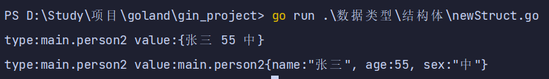

### 值列表初始化（法5）

* 初始化结构体的时候可以简写，也就是初始化的时候不写键，直接写值
* 必须初始化结构体的所有字段。
* 初始值的填充顺序必须与字段在结构体中的声明顺序一致。
* 该方式不能和键值初始化方式混用

```go
package main

import "fmt"

type person2 struct {
    name string
    age  int
    sex  string
}

func main() {
    p1 := &person2{
        name: "张三",
        age:  55,
        sex:  "中",
    }
    (*p1).name = "qqq"
    fmt.Printf("type:%T value:%[1]v \n", *p1)
    fmt.Printf("type:%T value:%#[1]v \n", *p1)

}
```

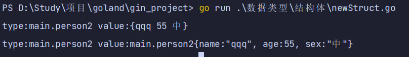

### 结构体的匿名字段

* 结构体允许其成员字段在声明时没有字段名而只有类型，这种没有名字的字段就称为匿名字段。
* 匿名字段默认采用类型名作为字段名，结构体要求字段名称必须唯一，因此一个结构体中同种类型的匿名字段只能有一个。

```go
package main

import "fmt"

type person3 struct {
    name string
    age  int
    string
}

func main() {
    p1 := person3{
        "张三",
        55,
        "嬲",
    }
    fmt.Printf("type:%T value:%[1]v \n", p1)
    fmt.Printf("type:%T value:%#[1]v \n", p1)
}
```

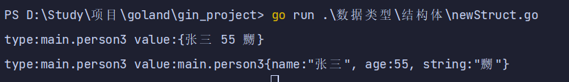

## 嵌套结构体

### 普通嵌套结构体

* 一个结构体中可以嵌套包含另一个结构体或结构体指针。

```go
package main

import "fmt"

type room struct {
    name string
}

type floor struct {
    name string
    room room
}

type building struct {
    name  name
    floor floor
}

func structTest1() {
    info := building{
        "大厦A",
        floor{
            "2楼",
            room{
                "A-2-3",
            },
        },
    }
    fmt.Printf("type:%T value:%[1]v \n", info)
    fmt.Printf("type:%T value:%#[1]v \n", info)

}

func main() {
    structTest1()
}
```

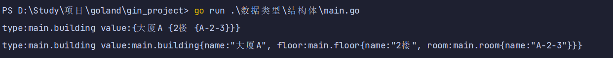

### 嵌套匿名结构体

* 注意：当访问结构体成员时会先在结构体中查找该字段，找不到再去匿名结构体中查找。

```go
package main

import "fmt"
type Room2 struct {
    name string
}

type Floor2 struct {
    name string
    Room2
}

type Building2 struct {
    name string
    Floor2
}

func structTest2() {
    // 需先初始化
    //info := new(Building2)
    info := Building2{}
    info.name = "B"
    info.Floor2.name = "5层"
    info.Room2.name = "B-5-6"
    fmt.Printf("type:%T value:%[1]v \n", info)
    fmt.Printf("type:%T value:%#[1]v \n", info)

}

func main() {
    structTest2()
}
```

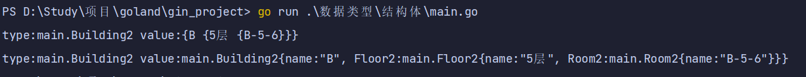

## 结构体方法和接收者

### 结构体说明

* 在 go 语言中，没有类的概念但是可以给类型（结构体，自定义类型）定义方法。
* 所谓方法就是定义了接收者的函数。
  * Go语言中的方法（Method）是一种作用于特定类型变量的函数。
  * 这种特定类型变量叫做接收者（Receiver）。
  * 接收者的概念就类似于其他语言中的this或者 self。
* 方法的定义格式如下：

```go
func (接收者变量 接收者类型) 方法名(参数列表) (返回参数) {
    函数体
}
```

* 给结构体 Person 定义一个方法打印 Person 的信息

### 结构体方法和接收者

```go
package main

import "fmt"

type room struct {
    name string
}

func (r room) structFunc() {
    fmt.Printf("type:%T value:%[1]v \n", r)
    fmt.Printf("type:%T value:%#[1]v \n", r)
}

func main() {
    r := room{
        name: "小王子",
    }
    r.structFunc()
}
```

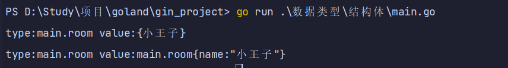

### 值类型和指针类型接收者

* 实例1：给结构体 Person 定义一个方法打印 Person 的信息
* 1、值类型的接收者
  * 当方法作用于值类型接收者时，Go 语言会在代码运行时将接收者的值复制一份。
  * 在值类型接收者的方法中可以获取接收者的成员值，但修改操作只是针对副本，无法修改接收者变量本身。
* 2、指针类型的接收者
  * 指针类型的接收者由一个结构体的指针组成
  * 由于指针的特性，调用方法时修改接收者指针的任意成员变量，在方法结束后，修改都是有效的。
  * 这种方式就十分接近于其他语言中面向对象中的 this 或者 self。

```go
package main

import "fmt"

type Person4 struct {
    name string
    age  int
}

//值类型接受者
func (p Person4) personName() {
    p.name = "张三"
    fmt.Printf("type:%T value:%#[1]v \n", p)

}

// 指针类型接受者
func (p *Person4) personAge() {
    p.age = 998
    fmt.Printf("type:%T value:%#[1]v \n", p)

}

func main() {
    p := Person4{}
    p.personAge()
    p.personName()

}
```

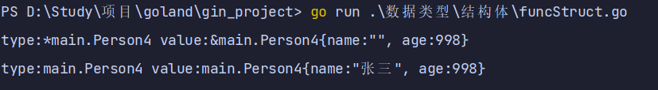

## 结构体继承

* Go 语言中使用结构体也可以实现其他编程语言中的继承

### 普通传值

```go
package main

import "fmt"

type room3 struct {
    name string
}

type floor3 struct {
    name  string
    room3 // 通过嵌套匿名结构体实现继承
}

func (r *room3) room() {
    r.name = "301"
}

func (f *floor3) floor() {
    f.name = "3层"
}

func main() {
    f := floor3{}
    f.room()
    f.floor()
    fmt.Printf("%v的%v室", f.name, f.room3.name)

}
```

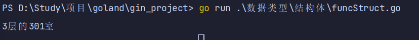

### 指针传值

```go
package main

import "fmt"
type room3 struct {
    name string
}

func (f *floor4) floor4() {
    f.name = "4层"
}

func main() {
    f := &floor4{
        name: "",
        room3: &room3{
            "403",
        },
    }
    f.floor4()
    fmt.Printf("%v的%v室", f.name, f.room3.name)
}
```

## 给任意类型添加方法

* 在 Go 语言中，接收者的类型可以是任何类型，不仅仅是结构体，任何类型都可以拥有方法。
* 举个例子，我们基于内置的 int 类型使用 type 关键字可以定义新的自定义类型，然后为我们的自定义类型添加方法。
* 注意事项： 非本地类型不能定义方法，也就是说我们不能给别的包的类型定义方法。

```go
package main

import "fmt"

type myInt int

func (i *myInt) myType() {
    fmt.Printf("type:%T value:%#[1]v \n", *i)
}

func main() {
    var i myInt
    i = 100
    i.myType()
}
```

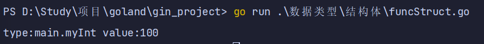

