# 查询v2

## 检索单个对象

GORM 提供了 `First`、`Take`、`Last` 方法，以便从数据库中检索单个对象。当查询数据库时它添加了 `LIMIT 1` 条件，且没有找到记录时，它会返回 `ErrRecordNotFound` 错误

```go
func QueryTest1(db *gorm.DB) {
    // 获取第一条记录（主键升序）
    user1 := User{}
    db.First(&user1)
    fmt.Println(user1)

    // 获取一条记录，没有指定排序字段
    user2 := User{}
    db.Take(&user2)
    fmt.Println(user2)

    // 获取最后一条记录（主键降序）
    user3 := User{}
    db.Last(&user3)
    fmt.Println(user3)

    result := db.First(&user1)
    fmt.Println(result.RowsAffected) // 返回找到的记录数
    fmt.Println(result.Error)        // returns error
    // 检查 ErrRecordNotFound 错误
    errors.Is(result.Error, gorm.ErrRecordNotFound)
}
```

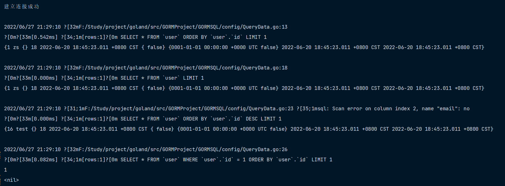

`First`、`Last` 方法会根据主键查找到第一个、最后一个记录， 它仅在通过 struct 或提供 model 值进行查询时才起作用。 如果 model 类型没有定义主键，则按第一个字段排序，例如：

```go
func QueryTest2(db *gorm.DB) {
    // 可以
    var user User
    db.First(&user)
    fmt.Println(user)
    fmt.Println()

    // 可以
    result := map[string]interface{}{}
    db.Model(&User{}).First(result)
    fmt.Println(result)
    fmt.Println()

    // 不行
    result2 := map[string]interface{}{}
    db.Table("user").First(result2)
    fmt.Println(result2)
    fmt.Println()

    // 但可以配合 Take 使用
    result3 := map[string]interface{}{}
    db.Table("user").Take(result3)
    fmt.Println(result3)
    fmt.Println()

    // 根据第一个字段排序
    result4 := db.First(&User{})
    fmt.Println(result4.RowsAffected)
}
```

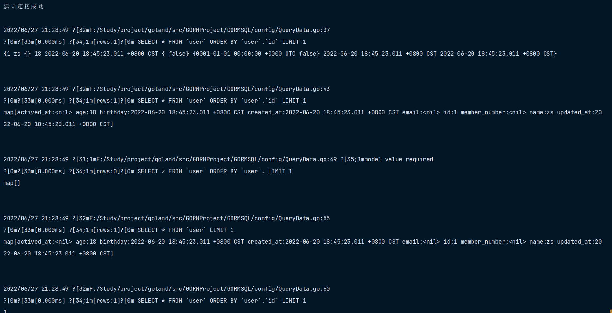

### 根据主键检索

您可以使用 [内联条件](https://learnku.com/docs/gorm/v2/query#inline_conditions) 来检索对象。 传入字符串参数时注意避免 SQL 注入问题，查看 [安全](https://learnku.com/docs/gorm/v2/security) 获取详情

```go
func QueryTest3(db *gorm.DB) {
    user := User{}
    db.First(&user, 10)
    fmt.Println(user)
    fmt.Println()

    user2 := User{}
    db.First(&user2, "10")
    fmt.Println(user2)
    fmt.Println()

    users := []User{
        {},
    }
    db.Find(&users, []int{1, 2, 3})
    for _, user := range users {
        fmt.Println(user)
    }
    fmt.Println()

}
```

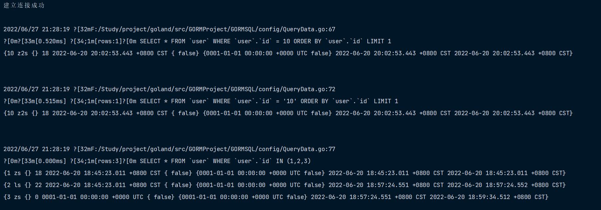

## 检索全部对象

```go
// QueryALlTest ## 检索全部对象
func QueryALlTest(db *gorm.DB) {
    users := []User{
        {},
    }
    result := db.Find(&users)
    for _, user := range users {
        fmt.Println(user)
    }
    fmt.Println(result.RowsAffected)
    fmt.Println(result.Error)

}
```

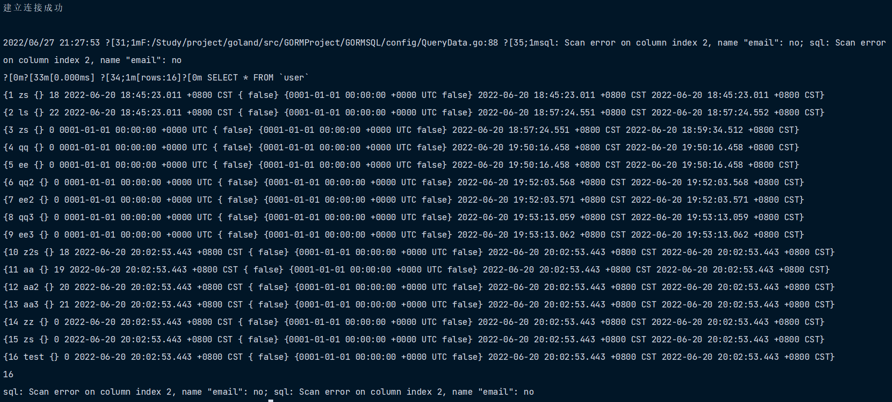

## 条件

### String 条件

```go
func FilterTest(db *gorm.DB) {
    // 获取第一条匹配的记录
    var user User
    db.Where("name = ?", "ee").First(&user)
    fmt.Println(user)

    // 获取全部匹配的记录
    users := []User{
        {},
    }
    result := db.Where("name = ?", "zs").Find(&users)
    fmt.Println(result.RowsAffected)

    // IN
    users = []User{
        {},
    }
    result2 := db.Where("name IN ?", []string{"zs", "aa"}).Find(&users)
    fmt.Println(result2.RowsAffected)

    // LIKE
    users = []User{
        {},
    }
    result3 := db.Where("name like ?", "%z%").Find(&users)
    fmt.Println(result3.RowsAffected)

    // AND
    users = []User{
        {},
    }
    result4 := db.Where("name = ? AND age >= ?", "zs", 18).Find(&users)
    fmt.Println(result4.RowsAffected)

    // Time
    users = []User{
        {},
    }
    result5 := db.Where("updated_at > ?", "2022-06-21 00:00:00").Find(&users)
    fmt.Println(result5.RowsAffected)

    // BETWEEN
    users = []User{
        {},
    }
    result6 := db.Where("created_at BETWEEN ? AND ?", "2022-06-20 00:00:00", "2022-06-21 00:00:00").Find(&users)
    fmt.Println(result6.RowsAffected)
}
```

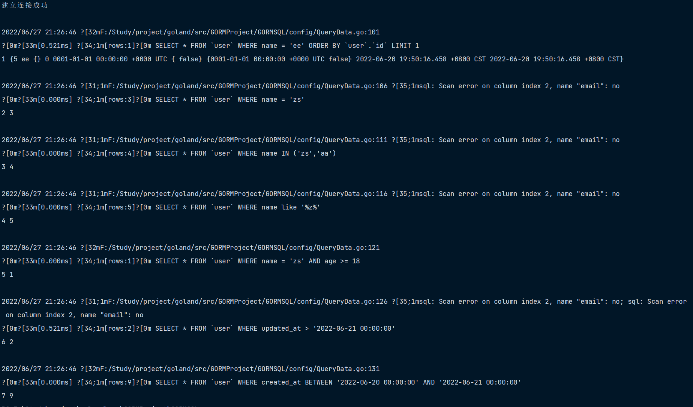

### Struct & Map 条件

```go
func FilterMapAndStruct(db *gorm.DB) {
	//Struct
	var user User
	db.Where(&User{Name: "zs", Age: 18}).First(&user)
	fmt.Println(user)

	// Map
	users := []User{
        {},
    }
	db.Where(map[string]interface{}{"name": "ls", "age": 22}).Find(&users)
	fmt.Println(users)

	// 主键切片条件
	users = []User{
        {},
    }
	db.Where([]int{1, 3, 5}).Find(&users)
	fmt.Println("主键切片条件", users)

}
```

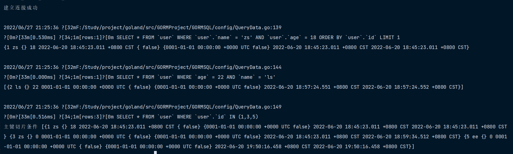

> **注意** 当使用结构作为条件查询时，GORM 只会查询非零值字段。这意味着如果您的字段值为 `0`、`''`、`false` 或其他 [零值](https://tour.golang.org/basics/12)，该字段不会被用于构建查询条件，例如：

```go
db.Where(&User{Name: "jinzhu", Age: 0}).Find(&users)
// SELECT * FROM users WHERE name = "jinzhu";
```

您可以使用 map 来构建查询条件，例如：

```go
db.Where(map[string]interface{}{"Name": "jinzhu", "Age": 0}).Find(&users)
// SELECT * FROM users WHERE name = "jinzhu" AND age = 0;
```

### 内联条件

用法与 `Where` 类似

```go
func FilterTest2(db *gorm.DB) {
	// 根据主键获取记录，如果是非整型主键
	var user User
	db.First(&user, "id = ?", "5")
	fmt.Println(1, user)

	// Plain SQL
	user = User{}
	db.Find(&user, "name = ?", "zs")
	fmt.Println(2, user)

	users := []User{
        {},
    }
	db.Find(&users, "name <> ? AND age > ?", "zs", 20)
	fmt.Println(3, users)

	// Struct
	users = []User{
        {},
    }
	db.Find(&users, User{Age: 22})
	fmt.Println(4, users)

	// Map
	users = []User{
        {},
    }
	db.Find(&users, map[string]interface{}{"age": 20})
	fmt.Println(5, users)

}

```

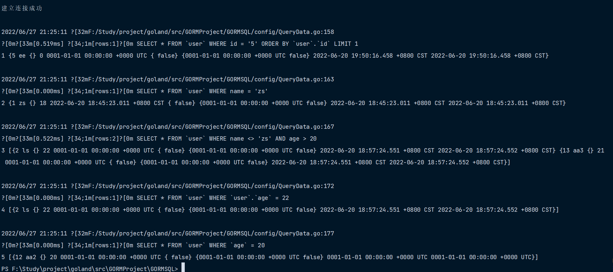

### Not 条件

构建 NOT 条件，用法与 `Where` 类似

```go
func FilterNot(db *gorm.DB) {
	var user User
	db.Not("name = ?", "zs").First(&user)
	fmt.Println(1, user)

	// Not In
	users := []User{
        {},
    }
	db.Not(map[string]interface{}{"name": []string{"zs", "ls"}}).Find(&users)
	fmt.Println(2, users)

	// Struct
	user = User{}
	db.Not(User{Name: "zs", Age: 18}).First(&user)
	fmt.Println(3, user)

	// 不在主键切片中的记录
	user = User{}
	db.Not([]int{1, 2, 3}).First(&user)
	fmt.Println(4, user)

}
```

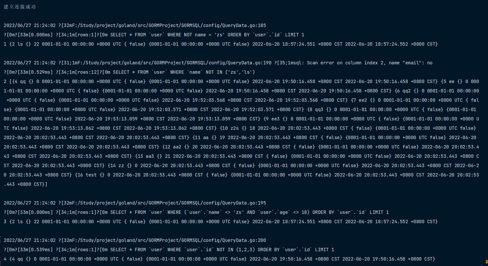

### Or 条件

```go
func FilterOr(db *gorm.DB) {
	users := []User{
        {},
    }
	db.Where("name = ?", "zs").Or("name = ?", "ls").Find(&users)
	fmt.Println(1, users)

	// Struct
	users = []User{
        {},
    }
	db.Where("name = 'zs'").Or(User{Name: "ls", Age: 22}).Find(&users)
	fmt.Println(2, users)

	// Map
	users = []User{
        {},
    }
	db.Where("name = ?", "zs").Or(map[string]interface{}{"name": "ls", "age": 22}).Find(&users)
	fmt.Println(3, users)

}
```

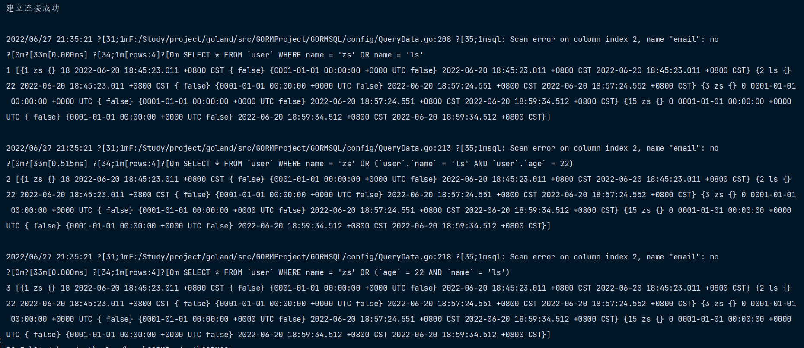

您还可以查看高级查询中的 [分组条件](https://learnku.com/docs/gorm/v2/advanced_query#group_conditions)，它被用于编写复杂 SQL

## 选择特定字段

选择您想从数据库中检索的字段，默认情况下会选择全部字段

```go
func SelectField(db *gorm.DB) {
	users := []User{
        {},
    }
	db.Select("name", "age").Find(&users)

	users = []User{
        {},
    }
	db.Select([]string{"name", "age"}).Find(&users)

	users = []User{
        {},
    }
	db.Table("user").Select("COALESCE(age,?)", 21).Rows()
}
```

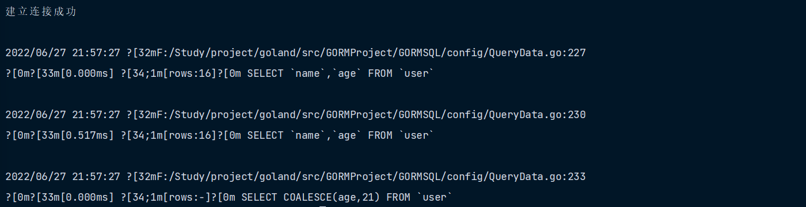

还可以看一看 [智能选择字段](https://learnku.com/docs/gorm/v2/advanced_query#smart_select)

## Order

指定从数据库检索记录时的排序方式

```go
func OrderData(db *gorm.DB) {
	users := []User{
        {},
    }
	db.Order("age desc, name").Find(&users)

	// 多个 order
	users = []User{
        {},
    }
	db.Order("age desc").Order("name").Find(&users)

	users = []User{
        {},
    }
	db.Clauses(clause.OrderBy{
		Expression: clause.Expr{SQL: "FIELD(id,?)", Vars: []interface{}{[]int{1, 2, 3}},
			WithoutParentheses: true},
	}).Find(&users)
}

```

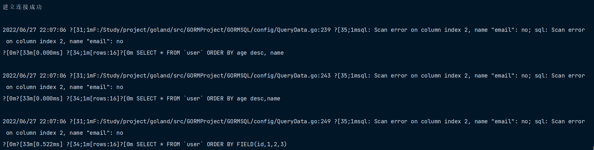

## Limit & Offset

`Limit` 指定获取记录的最大数量 `Offset` 指定在开始返回记录之前要跳过的记录数量

```go
func LimitAndOffset(db *gorm.DB) {
	users := []User{
        {},
    }
	db.Limit(3).Find(&users)
	fmt.Println(1, users)

	users = []User{
        {},
    }
	users2 := []User{
        {},
    }
	db.Limit(1).Find(&users).Limit(-1).Find(&users2)
	fmt.Println(2, users)
	fmt.Println(3, users2)

	users = []User{
        {},
    }
	db.Limit(5).Offset(3).Find(&users)
	fmt.Println(4, users)

	// 作者测试 Offset 必须配合 Limit 否则报错
	//users = []User{
    //    {},
    //}
	//db.Offset(10).Find(&users).Offset(-1).Find(&user)
}
```

查看 [Pagination](https://learnku.com/docs/gorm/v2/scopes#pagination) 学习如何写一个分页器

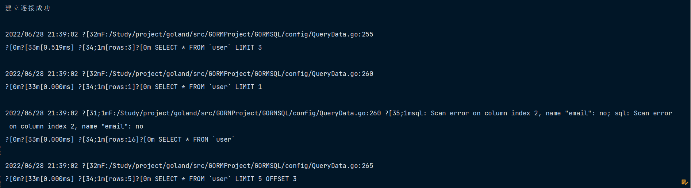

## Group & Having

```go
func GroupAndHaving(db *gorm.DB) {
	users := []User{
        {},
    }
	db.Model(&User{}).Select("name, sum(age) as total").Where(
		"name LIKE ?", "%z%").Group("name").Find(&users)
	fmt.Println(users)

	users = []User{
        {},
    }
	db.Model(&User{}).Select("name, sum(age) as total").Group(
		"name").Having("name = ?", "zs").First(&users)
	fmt.Println(users)

	/*
		rows, err := db.Table("orders").Select("date(created_at) as date, sum(amount) as total").Group("date(created_at)").Rows()
		for rows.Next() {
		  ...
		}

		rows, err := db.Table("orders").Select("date(created_at) as date, sum(amount) as total").Group("date(created_at)").Having("sum(amount) > ?", 100).Rows()
		for rows.Next() {
		  ...
		}

		type Result struct {
		  Date  time.Time
		  Total int64
		}
		db.Table("orders").Select("date(created_at) as date, sum(amount) as total").Group("date(created_at)").Having("sum(amount) > ?", 100).Scan(&results)
	*/
}

```

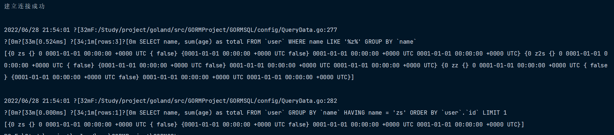

## Distinct

从模型中选择不相同的值

```go
func DistinctData(db *gorm.DB) {
	users := []User{
        {},
    }
	db.Distinct("name", "age").Order("name, age desc").Find(&users)
}

```

`Distinct` 也可以配合 [`Pluck`](https://learnku.com/docs/gorm/v2/advanced_query#pluck), [`Count`](https://learnku.com/docs/gorm/v2/advanced_query#count) 使用

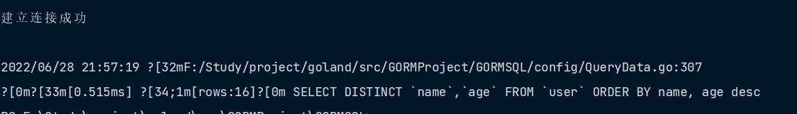

## Joins

指定 Joins 条件

```go
func JoinsModel(db *gorm.DB) {
	type Result struct {
		Name  string
		Name2 string
	}
	result := Result{}
	db.Model(&User{}).Select("user.name, user_infos.name").Joins(
		"left join user_infos on user_infos.name = user.name").Scan(&result)
	fmt.Println(result)

	/*
		rows, err := db.Table("users").Select("users.name, emails.email").Joins("left join emails on emails.user_id = users.id").Rows()
		for rows.Next() {
		  ...
		}

		db.Table("users").Select("users.name, emails.email").Joins("left join emails on emails.user_id = users.id").Scan(&results)

		// 带参数的多表连接
		db.Joins("JOIN emails ON emails.user_id = users.id AND emails.email = ?", "jinzhu@example.org").Joins("JOIN credit_cards ON credit_cards.user_id = users.id").Where("credit_cards.number = ?", "411111111111").Find(&user)
	*/
}

```

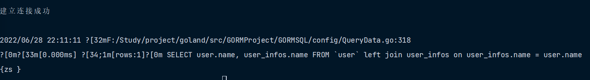

### Joins 预加载

您可以使用 `Joins` 实现单条 SQL 预加载关联记录，例如：

```go
func JoinsData(db *gorm.DB) {
	userInfos := []UserInfo{
        {},
    }
	db.Joins("CreditCard").Find(&userInfos)
}

```

参考 [预加载](https://learnku.com/docs/gorm/v2/preload) 了解详情

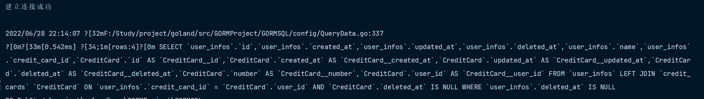

## Scan

Scan 结果至 struct，用法与 `Find` 类似

```go
func ScanData(db *gorm.DB) {
	type Result struct {
		Name string
		Age  int
	}
	result := Result{}
	db.Table("user").Select("name", "age").Scan(&result)
	fmt.Println(result)

	db.Raw("select name, age from user where name = ?", "ls").Scan(&result)
	fmt.Println(result)
}

```

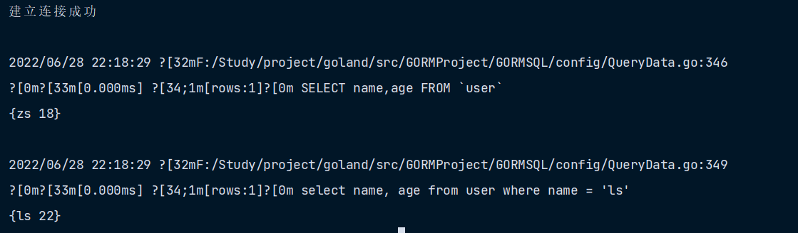

