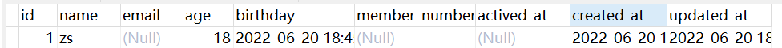
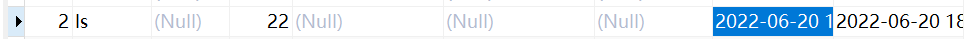
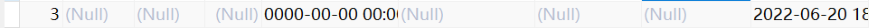
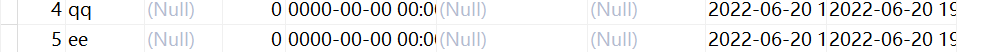
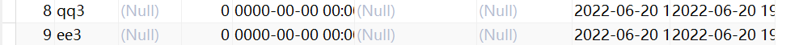
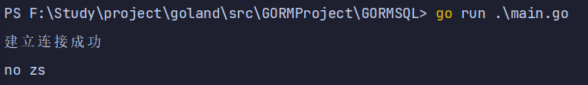
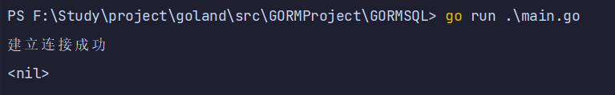
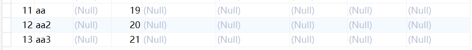

# 创建v2

## 建立连接，并创建表结构

通过 [入门指南/模型定义](https://yanxiang.wang/gorm/ru-men-zhi-nann/mo-xing-ding-yi.html) 创建表结构

```go
package config

import (
	"fmt"
	"gorm.io/driver/mysql"
	"gorm.io/gorm"
)

func Core() *gorm.DB {
	dsn := "root:root@tcp(127.0.0.1:3306)/gorm?charset=utf8mb4&parseTime=True&loc=Local"
	db, err := gorm.Open(mysql.Open(dsn))
	if err != nil {
		fmt.Println(err)
	}
	// 创建表
	err = db.AutoMigrate(&User{})
	if err != nil {
		return nil
	} // 根据User结构体建表
	fmt.Println("建立连接成功")
	return db
}
```

## 创建记录

```go
// CreateUser1 普通创建
func CreateUser1(db *gorm.DB) {
	user := User{Name: "zs", Age: 18, Birthday: time.Now()}
	result := db.Create(&user)       // 通过数据的指针来创建
	fmt.Println(result.Error)        // 返回 error
	fmt.Println(result.RowsAffected) // 返回插入记录的数量
}

```



## 用指定的字段创建记录

```go
// CreateUser2 指定字段创建
func CreateUser2(db *gorm.DB) {
	user := User{Name: "ls", Age: 22, CreatedAt: time.Now()}
}
```

创建记录并更新给出的字段。

```go
db.Select("Name", "Age", "CreatedAt").Create(&user)
// INSERT INTO `user` (`name`,`age`,`created_at`) VALUES ("jinzhu", 18, "2020-07-04 11:05:21.775")
```



创建记录并更新未给出的字段。

```go
db.Omit("Name", "Age", "CreatedAt").Create(&user)
// INSERT INTO `user` (`birthday`,`updated_at`) VALUES ("2020-01-01 00:00:00.000", "2020-07-04 11:05:21.775")
```



## 批量插入

要有效地插入大量记录，请将一个 `slice` 传递给 `Create` 方法。 将切片数据传递给 Create 方法，GORM 将生成一个单一的 SQL 语句来插入所有数据，并回填主键的值，钩子方法也会被调用。

```go
func CreateUser3(db *gorm.DB) {
	users := []User{
        {Name: "qq"}, {Name: "ee"},
    }
	db.Create(&users)

	for _, user := range users {
		fmt.Println(user.ID)
	}
}
```



使用 `CreateInBatches` 创建时，你还可以指定创建的数量，例如：

```go
// CreateUser4 批量创建，指定批量大小
func CreateUser4(db *gorm.DB) {
	users := []User{
        {Name: "qq3"}, {Name: "ee3"},
    }
	db.CreateInBatches(users, 1)

	for _, user := range users {
		fmt.Println(user.ID)
	}
}
```



[Upsert](https://learnku.com/docs/gorm/v2/create#upsert) 和 [Create With Associations](https://learnku.com/docs/gorm/v2/create#create_with_associations) 也支持批量插入

## 创建钩子

GORM 允许用户定义的钩子有 `BeforeSave`, `BeforeCreate`, `AfterSave`, `AfterCreate` 创建记录时将调用这些钩子方法，请参考 [Hooks](https://learnku.com/docs/gorm/v2/hooks) 中关于生命周期的详细信息

```go
func (u *User) BeforeCreate(tx *gorm.DB) (err error) {
	if u.Name != "zs" {
		return errors.New("no zs")
	}
	return
}

```

```
// CreateUser1 普通创建
func CreateUser1(db *gorm.DB) {
   user := User{Name: "z2s", Age: 18, Birthday: time.Now()}
   result := db.Create(&user)       // 通过数据的指针来创建
   fmt.Println(result.Error)        // 返回 error
}
```



如果您想跳过 `钩子` 方法，您可以使用 `SkipHooks` 会话模式，例如：

```go
DB.Session(&gorm.Session{SkipHooks: true}).Create(&user)

DB.Session(&gorm.Session{SkipHooks: true}).Create(&users)

DB.Session(&gorm.Session{SkipHooks: true}).CreateInBatches(users, 100)
```

```go
// CreateUser1 普通创建
func CreateUser1(db *gorm.DB) {
   user := User{Name: "z2s", Age: 18, Birthday: time.Now()}
   result := db.Session(&gorm.Session{SkipHooks: true}).Create(&user) // 跳过 `钩子` 方法
}
```




## 根据 Map 创建

GORM 支持根据 `map[string]interface{}` 和 `[]map[string]interface{}{}` 创建记录，例如：

```go
func CreateUser5(db *gorm.DB) {
	db.Model(&User{}).Create(map[string]interface{}{
		"Name": "aa", "Age": 19,
	})

	// batch insert from `[]map[string]interface{}{}`
	db.Model(&User{}).Create([]map[string]interface{}{
		{"Name": "aa2", "Age": 20},
		{"Name": "aa3", "Age": 21},
	})
}

```

> **注意：** 根据 map 创建记录时，association 不会被调用，且主键也不会自动填充



## 使用 SQL 表达式、Context Valuer 创建记录

GORM 允许使用 SQL 表达式插入数据，有两种方法实现这个目标。根据 `map[string]interface{}` 或 [自定义数据类型](https://learnku.com/docs/gorm/v2/data_types#gorm_valuer_interface) 创建，例如：

```go
// 通过 map 创建记录
db.Model(User{}).Create(map[string]interface{}{
  "Name": "jinzhu",
  "Location": clause.Expr{SQL: "ST_PointFromText(?)", Vars: []interface{}{"POINT(100 100)"}},
})
// INSERT INTO `users` (`name`,`point`) VALUES ("jinzhu",ST_PointFromText("POINT(100 100)"));

// 通过自定义类型创建记录
type Location struct {
    X, Y int
}

// Scan 方法实现了 sql.Scanner 接口
func (loc *Location) Scan(v interface{}) error {
  // Scan a value into struct from database driver
}

func (loc Location) GormDataType() string {
  return "geometry"
}

func (loc Location) GormValue(ctx context.Context, db *gorm.DB) clause.Expr {
  return clause.Expr{
    SQL:  "ST_PointFromText(?)",
    Vars: []interface{}{fmt.Sprintf("POINT(%d %d)", loc.X, loc.Y)},
  }
}

type User struct {
  Name     string
  Location Location
}

db.Create(&User{
  Name:     "jinzhu",
  Location: Location{X: 100, Y: 100},
})
// INSERT INTO `users` (`name`,`point`) VALUES ("jinzhu",ST_PointFromText("POINT(100 100)"))
```


## 高级选项

### 关联创建

创建关联数据时，如果关联值是非零值，这些关联会被 upsert，且它们的 `Hook` 方法也会被调用

```go
type CreditCard struct {
  gorm.Model
  Number   string
  UserID   uint
}

type User struct {
  gorm.Model
  Name       string
  CreditCard CreditCard
}

db.Create(&User{
  Name: "jinzhu",
  CreditCard: CreditCard{Number: "411111111111"}
})
// INSERT INTO `users` ...
// INSERT INTO `credit_cards` ...
```

您也可以通过 `Select`、 `Omit` 跳过关联保存，例如：

```go
db.Omit("CreditCard").Create(&user)

// 跳过所有关联
db.Omit(clause.Associations).Create(&user)
```

### 默认值

您可以通过标签 `default` 为字段定义默认值，如：

```go
type User struct {
  ID   int64
  Name string `gorm:"default:galeone"`
  Age  int64  `gorm:"default:18"`
}
```

插入记录到数据库时，默认值 *会被用于* 填充值为 [零值](https://tour.golang.org/basics/12) 的字段

> **注意** 像 `0`、`''`、`false` 等零值，不会将这些字段定义的默认值保存到数据库。您需要使用指针类型或 Scanner/Valuer 来避免这个问题，例如：

```go
type User struct {
  gorm.Model
  Name string
  Age  *int           `gorm:"default:18"`
  Active sql.NullBool `gorm:"default:true"`
}
```

> **注意** 若要数据库有默认、虚拟 / 生成的值，你必须为字段设置 `default` 标签。若要在迁移时跳过默认值定义，你可以使用 `default:(-)`，例如：

```go
type User struct {
  ID        string `gorm:"default:uuid_generate_v3()"` // 数据库函数
  FirstName string
  LastName  string
  Age       uint8
  FullName  string `gorm:"->;type:GENERATED ALWAYS AS (concat(firstname,' ',lastname));default:(-);`
}
```

使用虚拟 / 生成的值时，你可能需要禁用它的创建、更新权限，查看 [字段级权限](https://learnku.com/docs/gorm/v2/models#field_permission) 获取详情

### Upsert 及冲突

GORM 为不同数据库提供了兼容的 Upsert 支持

```go
import "gorm.io/gorm/clause"

// 有冲突时什么都不做
db.Clauses(clause.OnConflict{DoNothing: true}).Create(&user)

// 当 `id` 有冲突时，更新指定列为默认值
db.Clauses(clause.OnConflict{
  Columns:   []clause.Column{
      {Name: "id"},
  },
  DoUpdates: clause.Assignments(map[string]interface{}{"role": "user"}),
}).Create(&users)
// MERGE INTO "users" USING *** WHEN NOT MATCHED THEN INSERT *** WHEN MATCHED THEN UPDATE SET ***; SQL Server
// INSERT INTO `users` *** ON DUPLICATE KEY UPDATE ***; MySQL

// 当 `id` 有冲突时，更新指定列为新值
db.Clauses(clause.OnConflict{
  Columns:   []clause.Column{
      {Name: "id"},
  },
  DoUpdates: clause.AssignmentColumns([]string{"name", "age"}),
}).Create(&users)
// MERGE INTO "users" USING *** WHEN NOT MATCHED THEN INSERT *** WHEN MATCHED THEN UPDATE SET "name"="excluded"."name"; SQL Server
// INSERT INTO "users" *** ON CONFLICT ("id") DO UPDATE SET "name"="excluded"."name", "age"="excluded"."age"; PostgreSQL
// INSERT INTO `users` *** ON DUPLICATE KEY UPDATE `name`=VALUES(name),`age=VALUES(age); MySQL

// Update all columns expects primary keys to new value on conflict
db.Clauses(clause.OnConflict{
  UpdateAll: true
}).Create(&users)
// INSERT INTO "users" *** ON CONFLICT ("id") DO UPDATE SET "name"="excluded"."name", "age"="excluded"."age", ...;
```

也可以查看 [高级查询](https://learnku.com/docs/gorm/v2/advanced_query) 中的 `FirstOrInit`, `FirstOrCreate`

查看 [原生 SQL 及构造器](https://learnku.com/docs/gorm/v2/sql_builder) 获取详情