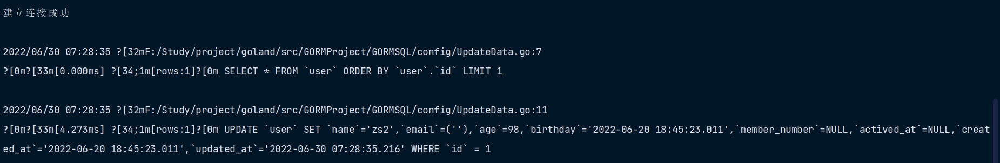
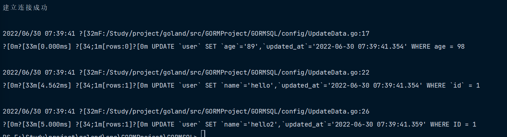
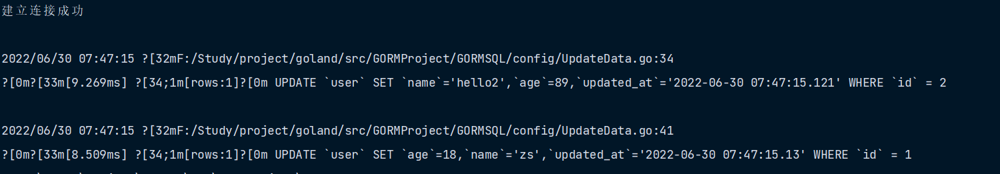
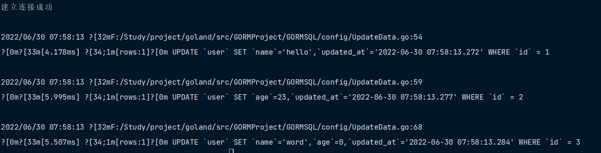
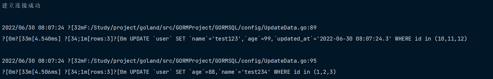
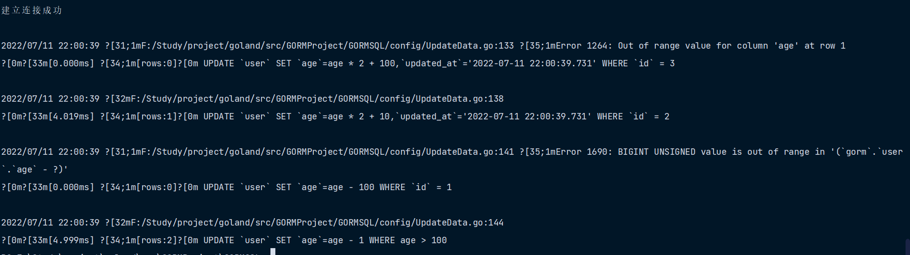
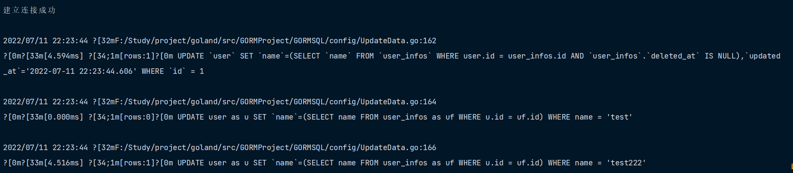
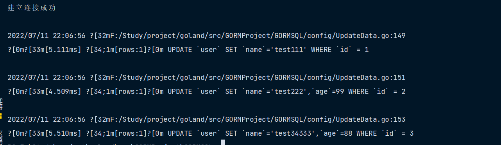
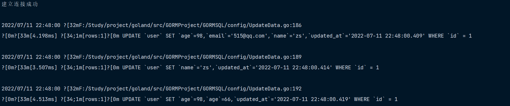
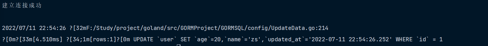

# 更新v2

## 保存所有字段

`Save` 会保存所有的字段，即使字段是零值

```go
func UpdateData1(db *gorm.DB) {
    var user User
    db.First(&user)

    user.Name = "zs2"
    user.Age = 98
    db.Save(&user)
}
```



## 更新单个列

当使用 `Update` 更新单个列时，你需要指定条件，否则会返回 `ErrMissingWhereClause` 错误，查看 [Block Global Updates](https://learnku.com/docs/gorm/v2/update#block_global_updates) 获取详情。当使用了 `Model` 方法，且该对象主键有值，该值会被用于构建条件，例如：

```go
// UpdateData2 更新单个列
func UpdateData2(db *gorm.DB) {
    // 条件更新
    db.Model(&User{}).Where("age = ?", 98).Update("age", "89")

    var user User
    // User 的 ID 是 1
    user.ID = 1
    db.Model(&user).Update("name", "hello")

    // 根据条件和model的值进行更新
    user = User{}
    db.Model(&user).Where("ID = ?", 1).Update("name", "hello2")
}
```



## 更新多列

`Updates` 方法支持 `struct` 和 `map[string]interface{}` 参数。当使用 `struct` 更新时，默认情况下，GORM 只会更新非零值的字段

```go
func UpdateData3(db *gorm.DB) {
    // 根据 `struct` 更新属性，只会更新非零值的字段
    var user User
    user.ID = 2
    db.Model(&user).Updates(User{
        Name: "hello2",
        Age:  89,
    })

    // 根据 `map` 更新属性
    user = User{}
    user.ID = 1
    db.Model(&user).Updates(map[string]interface{}{
        "name": "zs",
        "age":  18,
    })
}
```



> **注意** 当通过 struct 更新时，GORM 只会更新非零字段。 如果您想确保指定字段被更新，你应该使用 `Select` 更新选定字段，或使用 `map` 来完成更新操作

## 更新选定字段

如果您想要在更新时选定、忽略某些字段，您可以使用 `Select`、`Omit`

```go
func UpdateData4(db *gorm.DB) {
    user := User{
        ID: 1,
    }
    db.Model(&user).Select("name").Updates(map[string]interface{}{"name": "hello", "age": 28})

    user = User{
        ID: 2,
    }
    db.Model(&user).Omit("name").Updates(map[string]interface{}{
        "name": "ls",
        "age":  23,
    })

    // Select 和 Struct （可以选中更新零值字段）
    user = User{
        ID: 3,
    }
    db.Model(&user).Select("Name", "Age").Updates(User{
        Name: "word",
        Age:  0,
    })
}
```



## 更新 Hook

对于更新操作，GORM 支持 `BeforeSave`、`BeforeUpdate`、`AfterSave`、`AfterUpdate` 钩子，这些方法将在更新记录时被调用，详情请参阅 [钩子](https://learnku.com/docs/gorm/v2/hooks)

```go
func (u *User) BeforeUpdate(tx *gorm.DB) (err error) {
    if u.Role == "admin" {
        return errors.New("admin user not allowed to update")
    }
    return
}
```

## 批量更新

如果您尚未通过 `Model` 指定记录的主键，则 GORM 会执行批量更新

```go
func UpdateData5(db *gorm.DB) {
    // 根据 struct 更新
    db.Model(&User{}).Where("id in (?)", []int{10, 11, 12}).Updates(User{
        Name: "test123",
        Age:  99,
    })

    // 根据 map 更新
    db.Table("user").Where("id in ?", []int{1, 2, 3}).Updates(map[string]interface{}{
        "name": "test234",
        "age":  88,
    })
}
```



### 阻止全局更新

如果在没有任何条件的情况下执行批量更新，默认情况下，GORM 不会执行该操作，并返回 `ErrMissingWhereClause` 错误

对此，你必须加一些条件，或者使用原生 SQL，或者启用 `AllowGlobalUpdate` 模式，例如：

```go
func UpdateData6(db *gorm.DB) {
    db.Model(&User{}).Update("name", "zs")

    db.Model(&User{}).Where("1 = 1").Update("name", "zs")

    db.Exec("UPDATE user set name = ?", "ls")

    db.Session(&gorm.Session{AllowGlobalUpdate: true}).Model(&User{}).Update("age", 20)
}
```


### 更新的记录数

获取受更新影响的行数

```go
func UpdateData7(db *gorm.DB) {
    // 通过 `RowsAffected` 得到更新的记录数
    result := db.Model(&User{}).Where("id in ?", []int{10, 11, 12, 13}).Updates(User{Name: "zs"})
    fmt.Println(result.RowsAffected)
    fmt.Println(result.Error)
}
```


## 高级选项

### 使用 SQL 表达式更新

GORM 允许使用 SQL 表达式更新列，例如：

```go
func UpdateData9(db *gorm.DB) {
	user := User{
		ID: 3,
	}
	db.Model(&user).Update("age", gorm.Expr("age * ? + ?", 2, 100))

	user = User{
		ID: 2,
	}
	db.Model(&user).Updates(map[string]interface{}{"age": gorm.Expr("age * ? + ?", 2, 10)})

	user = User{ID: 1}
	db.Model(&user).UpdateColumn("age", gorm.Expr("age - ?", 100))

	user = User{}
	db.Model(&user).Where("age > 100").UpdateColumn("age", gorm.Expr("age - ?", 1))
}

```



并且 GORM 也允许使用 SQL 表达式、[自定义数据类型](https://learnku.com/docs/gorm/v2/data_types#gorm_valuer_interface)的 Context Valuer 来更新，例如：

```go
// 根据自定义数据类型创建
type Location struct {
    X, Y int
}

func (loc Location) GormValue(ctx context.Context, db *gorm.DB) clause.Expr {
  return clause.Expr{
    SQL:  "ST_PointFromText(?)",
    Vars: []interface{}{fmt.Sprintf("POINT(%d %d)", loc.X, loc.Y)},
  }
}

db.Model(&User{ID: 1}).Updates(User{
  Name:  "jinzhu",
  Point: Point{X: 100, Y: 100},
})
// UPDATE `user_with_points` SET `name`="jinzhu",`point`=ST_PointFromText("POINT(100 100)") WHERE `id` = 1
```

### 根据子查询进行更新

使用子查询更新表

```go
// UpdateData11 根据子查询进行更新
func UpdateData11(db *gorm.DB) {
	db.Model(&User{ID: 1}).Update("name", db.Model(&UserInfo{}).Select("name").Where("user.id = user_infos.id"))

	db.Table("user as u").Where("name = ?", "test").Update("name", db.Table("user_infos as uf").Select("name").Where("u.id = uf.id"))

	db.Table("user as u").Where("name = ?", "test222").Updates(map[string]interface{}{"name": db.Table("user_infos as uf").Select("name").Where("u.id = uf.id")})
}

```



### 不使用 Hook 和时间追踪

如果您想在更新时跳过 `Hook` 方法且不追踪更新时间，可以使用 `UpdateColumn`、`UpdateColumns`，其用法类似于 `Update`、`Updates`

```go
func UpdateData10(db *gorm.DB) {
	db.Model(&User{ID: 1}).UpdateColumn("name", "test111")

	db.Model(&User{ID: 2}).UpdateColumns(User{Name: "test222", Age: 99})

	db.Model(&User{ID: 3}).Select("name", "age").UpdateColumns(User{
		Name: "test34333",
		Age:  88,
	})

}
```



### 检查字段是否有变更？

GORM 提供了 `Changed` 方法，它可以被用在 **Before Update Hook** 里，它会返回字段是否有变更的布尔值

`Changed` 方法只能与 `Update`、`Updates` 方法一起使用，并且它只是检查 Model 对象字段的值与 `Update`、`Updates` 的值是否相等，如果值有变更，且字段没有被忽略，则返回 true

```go
func (u *User) BeforeUpdate(db *gorm.DB) (err error) {
	if db.Statement.Changed("MemberNumber") {
		return errors.New("MemberNumber not allowed to change")
	}

	if db.Statement.Changed("Name", "Age") {
		db.Statement.SetColumn("Age", 98)
	}

	if db.Statement.Changed() {
		db.Statement.SetColumn("email", "515@qq.com")
	}
	return nil
}


func UpdateData12(db *gorm.DB) {
	db.Model(&User{ID: 1}).Updates(map[string]interface{}{"name": "zs"})
	// Changed("Name") => true

	db.Model(&User{ID: 1, Name: "zs"}).Updates(map[string]interface{}{"name": "zs"})
	// Changed("Name") => false, 因为 `Name` 没有变更

	db.Model(&User{ID: 1, Name: "zs"}).Select("Age").Updates(map[string]interface{}{"name": "zs2", "age": 66})
	// Changed("Name") => false, 因为 `Name` 没有被 Select 选中并更新

	//测试失败
	//db.Model(&User{ID: 1, Name: "jinzhu"}).Updates(User{Name: "jinzhu2"})
	//// Changed("Name") => true
	//db.Model(&User{ID: 1, Name: "jinzhu"}).Updates(User{Name: "jinzhu"})
	//// Changed("Name") => false, 因为 `Name` 没有变更
	//db.Model(&User{ID: 1, Name: "jinzhu"}).Select("Admin").Updates(User{Name: "jinzhu2"})
	//// Changed("Name") => false, 因为 `Name` 没有被 Select 选中并更新

}
```



### 在更新时修改值

若要在 Before 钩子中改变要更新的值，如果它是一个完整的更新，可以使用 `Save`；否则，应该使用 `SetColumn` ，例如：

```go
func (user *User) BeforeSave(db *gorm.DB) (err error) {
	if db.Statement.Changed("name") {
		user.Age += 20
		db.Statement.SetColumn("Age", user.Age)
	}
	return nil
}

// UpdateData13 在更新时修改值？
func UpdateData13(db *gorm.DB) {
	db.Model(&User{ID: 1}).Updates(map[string]interface{}{"name": "zs"})
	// Changed("Name") => true

}

```

