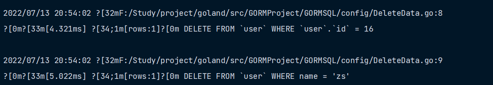
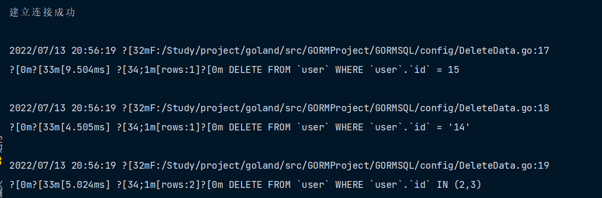
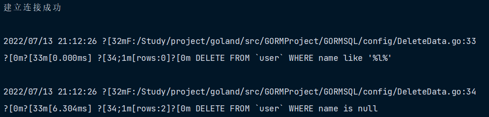
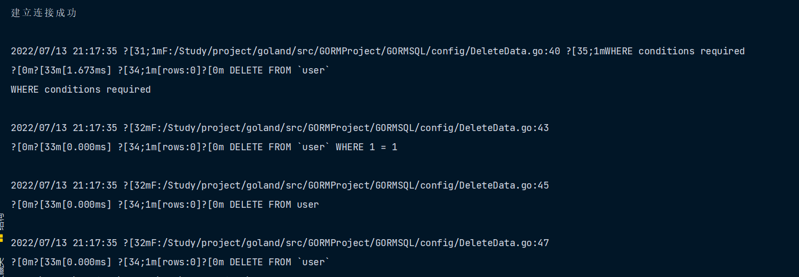
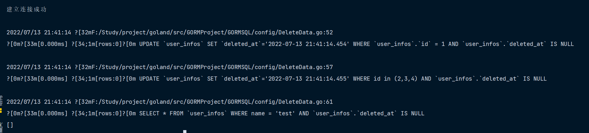
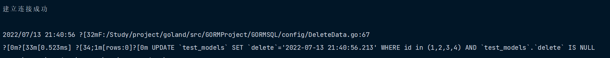
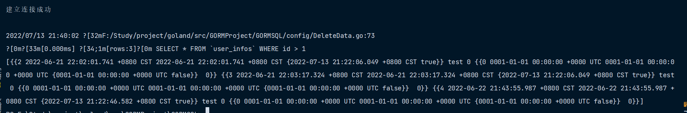
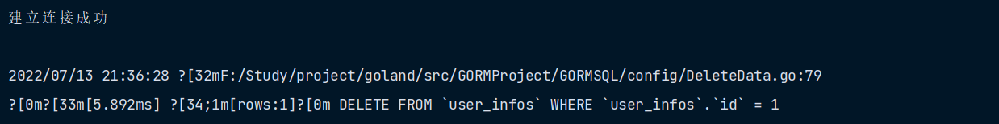

## 删除一条记录

删除一条记录时，删除对象需要指定主键，否则会触发 [批量 Delete](https://learnku.com/docs/gorm/v2/delete#batch_delete)，例如：

```go
func DeleteData1(db *gorm.DB) {
	// 删除ID = 16
	db.Delete(&User{ID: 16})
	// 带额外条件的删除
	db.Where("name = ?", "zs").Delete(&User{})
}
```



## 根据主键删除

GORM 允许通过内联条件指定主键来检索对象，但只支持整型数值，因为 string 可能导致 SQL 注入。查看 [内联条件、安全](https://learnku.com/docs/gorm/v2/query.thml#inline_conditions) 获取详情

```go
func DeleteData2(db *gorm.DB) {
	db.Delete(&User{}, 15)
	db.Delete(&User{}, "14")
	db.Delete(&User{}, []int{2, 3})
}

```



## Delete Hook

对于删除操作，GORM 支持 `BeforeDelete`、`AfterDelete` Hook，在删除记录时会调用这些方法，查看 [Hook](https://learnku.com/docs/gorm/v2/hooks) 获取详情

```go
func (u *User) BeforeDelete(tx *gorm.DB) (err error) {
    if u.Role == "admin" {
        return errors.New("admin user not allowed to delete")
    }
    return
}
```

## 批量删除

如果指定的值不包括主属性，那么 GORM 会执行批量删除，它将删除所有匹配的记录

```go
func DeleteData3(db *gorm.DB) {
	db.Where("name like ?", "%l%").Delete(&User{})
	db.Delete(&User{}, "name is null")
}
```



### 阻止全局删除

如果在没有任何条件的情况下执行批量删除，GORM 不会执行该操作，并返回 `ErrMissingWhereClause` 错误

对此，你必须加一些条件，或者使用原生 SQL，或者启用 `AllowGlobalUpdate` 模式，例如：

```go
func DeleteData4(db *gorm.DB) {
	err := db.Delete(&User{}).Error
	fmt.Println(err)

	db.Where("1 = 1").Delete(&User{})

	db.Exec("DELETE FROM user")

	db.Session(&gorm.Session{AllowGlobalUpdate: true}).Delete(&User{})
}
```



## 软删除

如果您的模型包含了一个 `gorm.deletedat` 字段（`gorm.Model` 已经包含了该字段)，它将自动获得软删除的能力！

拥有软删除能力的模型调用 `Delete` 时，记录不会被从数据库中真正删除。但 GORM 会将 `DeletedAt` 置为当前时间， 并且你不能再通过正常的查询方法找到该记录。

```go
func DeleteData5(db *gorm.DB) {
	db.Delete(&UserInfo{
		Model: gorm.Model{ID: 1},
	})

	// 批量删除
	db.Where("id in (?)", []int{2, 3, 4}).Delete(&UserInfo{})

	// 在查询时会忽略被软删除的记录
	var userInfo []UserInfo
	db.Where("name = ?", "test").Find(&userInfo)
	fmt.Println(userInfo)
}
```

如果您不想引入 `gorm.Model`，您也可以这样启用软删除特性：

```go
type TestModel struct {
  ID      int
  Deleted gorm.DeletedAt
  Name    string
}

func DeleteData6(db *gorm.DB) {
	db.Where("id in (?)", []int{1, 2, 3, 4}).Delete(&TestModel{})
}

```



### 查找被软删除的记录

您可以使用 `Unscoped` 找到被软删除的记录

```go
func GetDeleteData1(db *gorm.DB) {
	var userInfo []UserInfo
	db.Unscoped().Where("id > ?", 1).Find(&userInfo)
	fmt.Println(userInfo)
}

```



### 永久删除

您也可以使用 `Unscoped` 永久删除匹配的记录

```go
func DeleteDataUnscoped(db *gorm.DB) {
	db.Unscoped().Delete(&UserInfo{Model: gorm.Model{ID: 1}})
}
```

