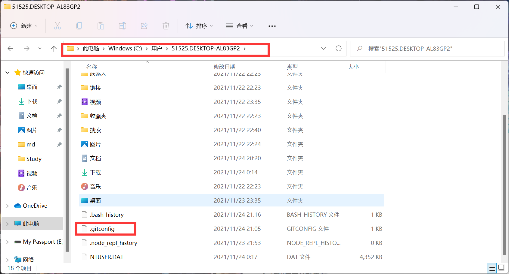
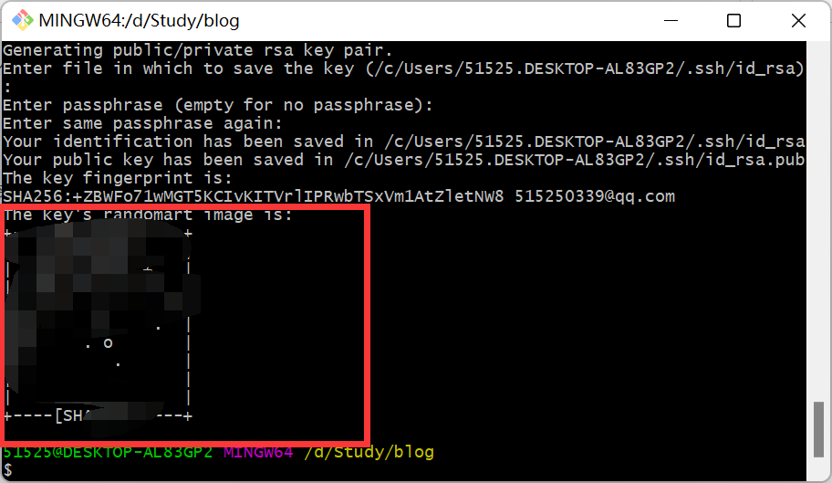
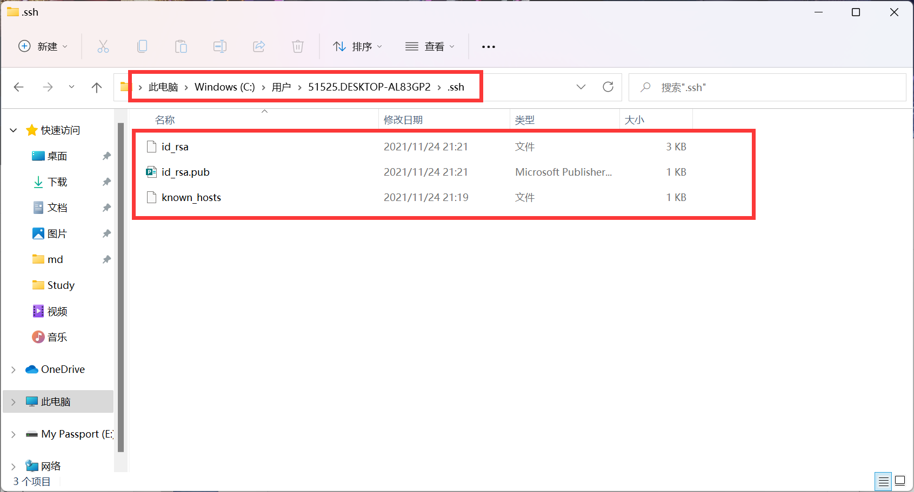
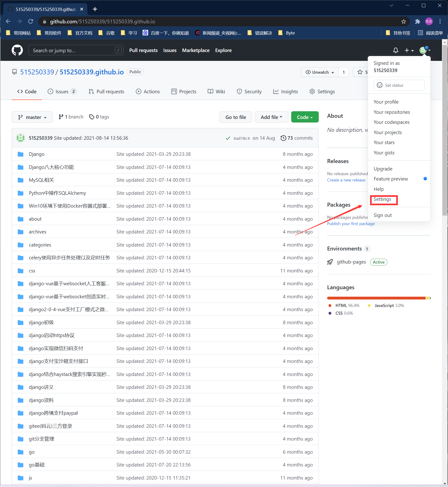
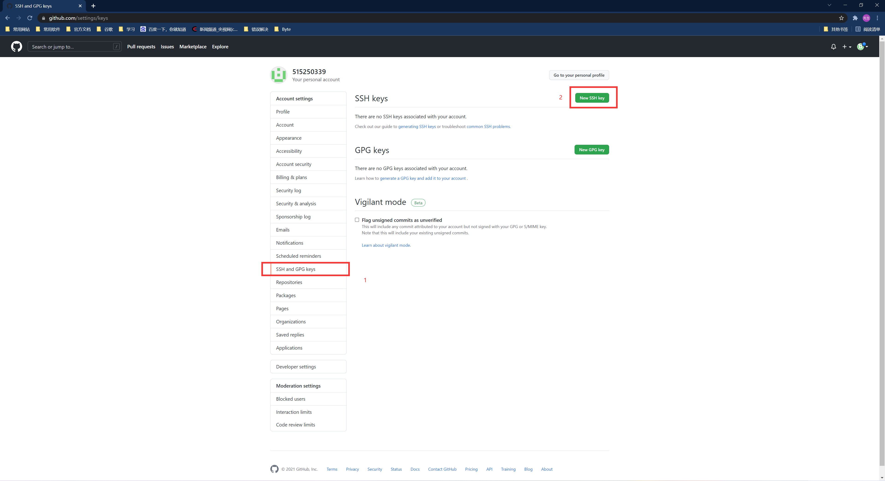
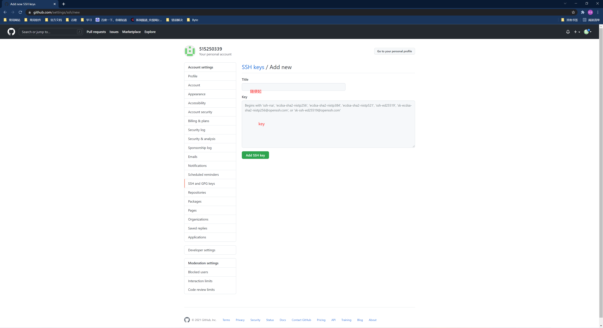
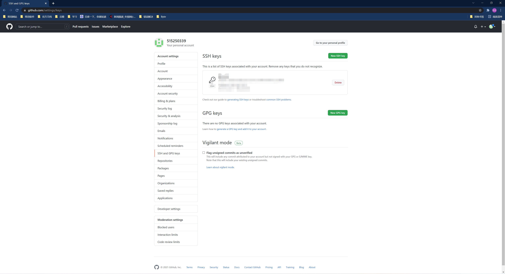
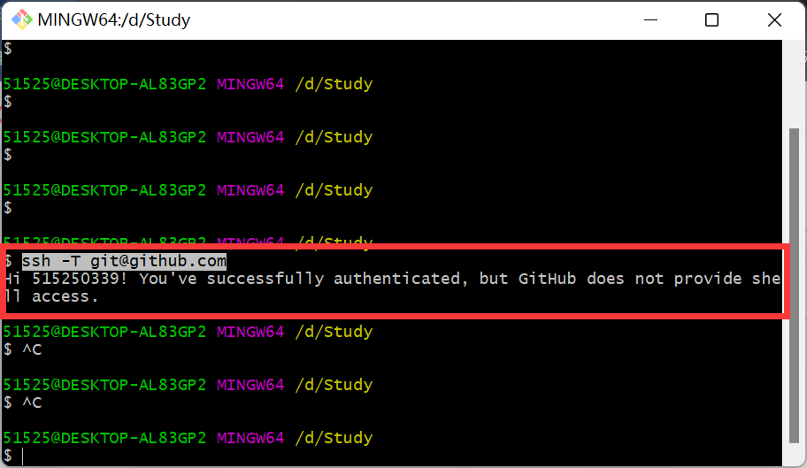
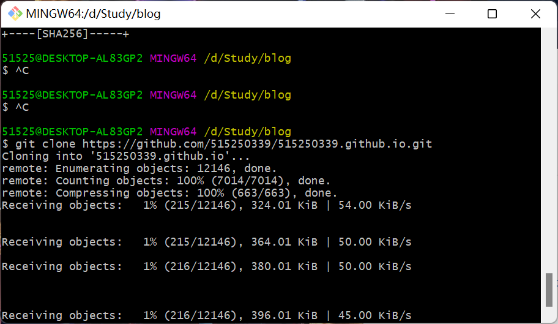

# 新机拉取github项目

1. ## git 全局配置 用户名 和 邮箱

   ```bash
   # 用户名
   git config --global user.name 【name】
   # 邮箱
   git config --global user.email 【email】
   # 查看已配置项
   git config --global --list
   # 或者
   git config --list
   ```

   或者查看 本机config文件

   

2. 接着生成 git 的 ssh 密钥

   ```bash
   ssh-keygen -t rsa -C [email]
   ```

   

3. 接着在本地查看ssh文件

   

4. 然后登录 github 操作

   

   

5. 将ssh文件中 id_rsa.pub copy 到里面，名称随便起

   

6. 这就表示成功了

   

7. 测试 输入，表示成功

   ```bash
   ssh -T git@github.com
   ```

   

8. 接着clone 项目 就可以了

   