1. 下载vm
2. 下载ubuntu镜像
3. 升级电脑到专业版
4. 开启 Hyper-v 功能

5. 重启电脑

6. 打开 vm

7. 开始安装

   1. 创建新的虚拟机

      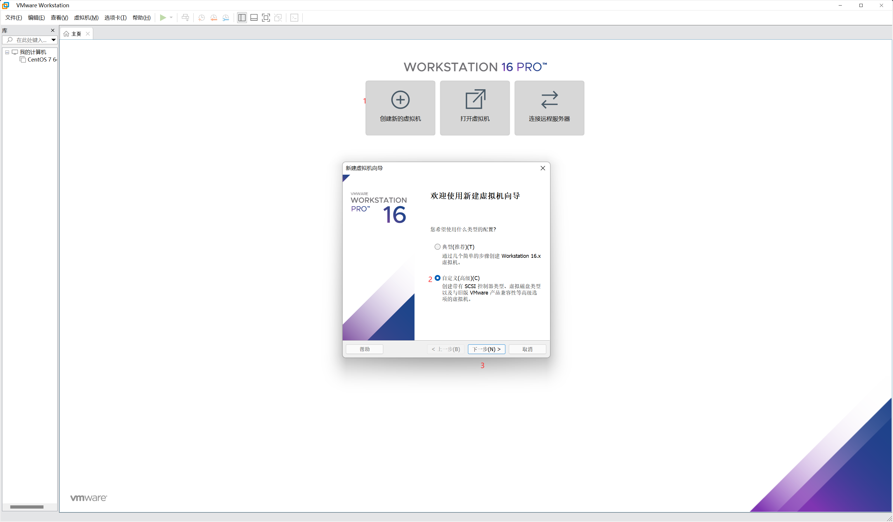

   2. 配置信息 不修改 下一步

      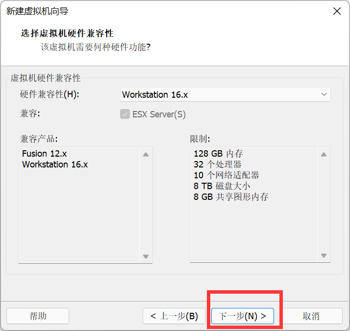

   3. 选择镜像

      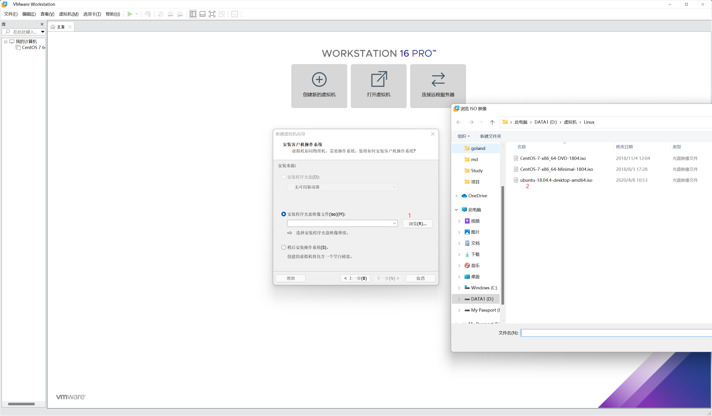

   4. 设置名称以及账户密码 然后下一步

      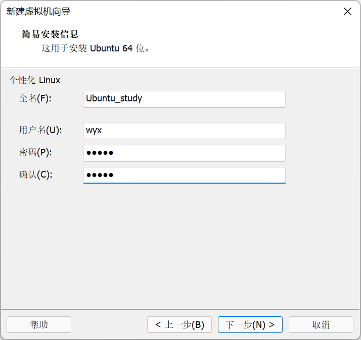

   5. 设置处理器 根据自己的电脑配置设置(并不是越高越好)

      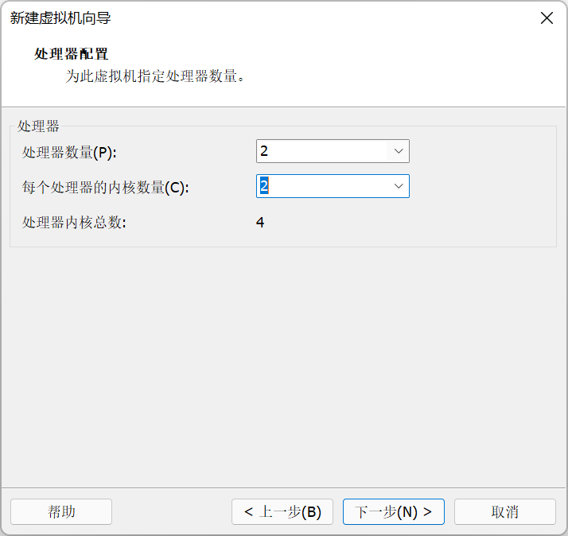

   6. 设置 内存

      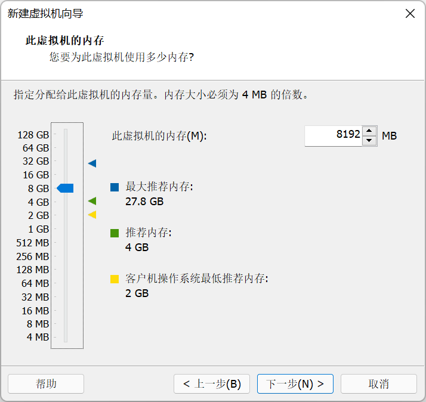

   7. 网络模式 NAT

      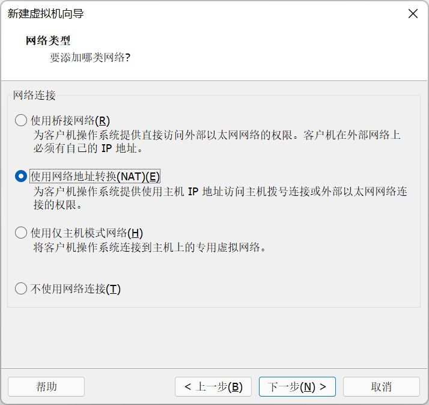

   8. I/O 推荐即可

      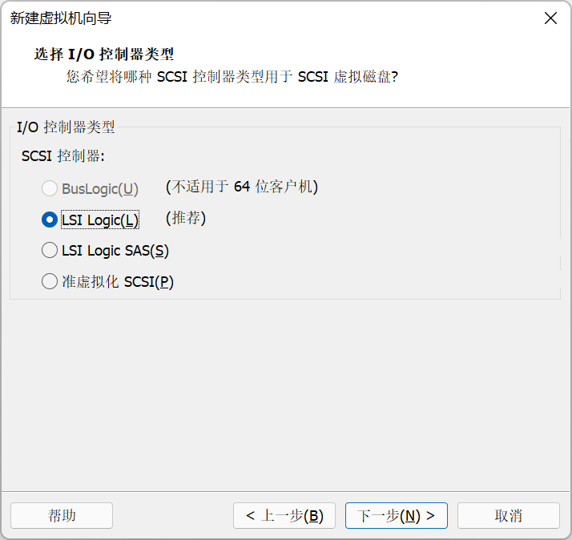

   9. 磁盘 推荐即可

      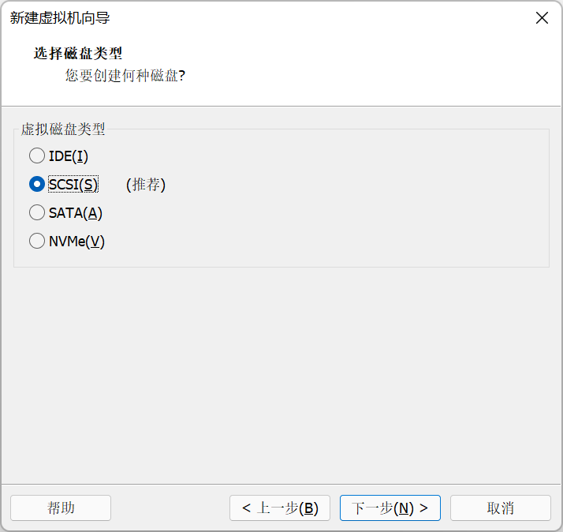

   10. 内存 用不了多少东西 这样会更快（除非拿虚拟机当主力机器）

       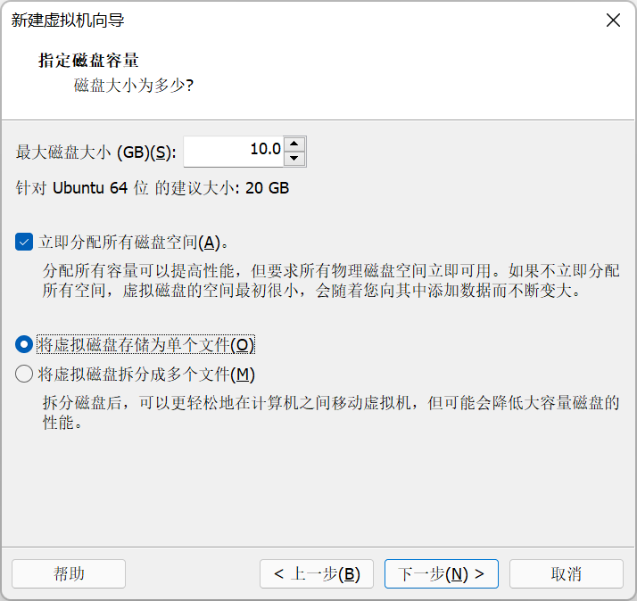

   11. 无需更改

       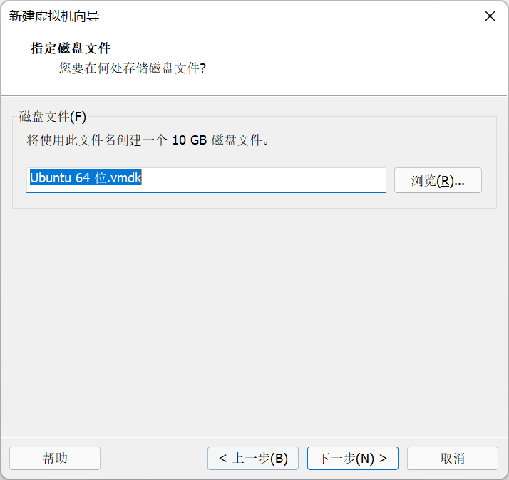

   12. 无需自定义(以后也可以修改)

       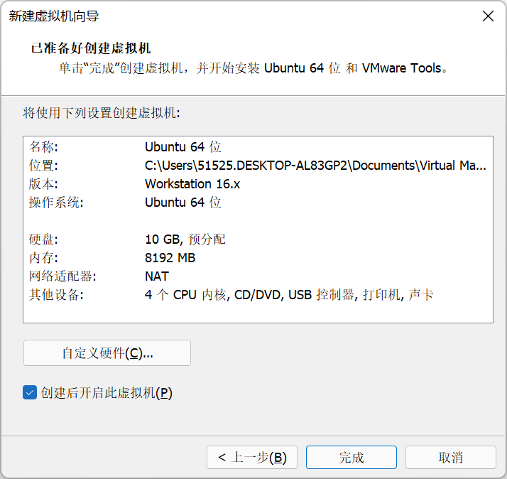

   13. 点击完成

       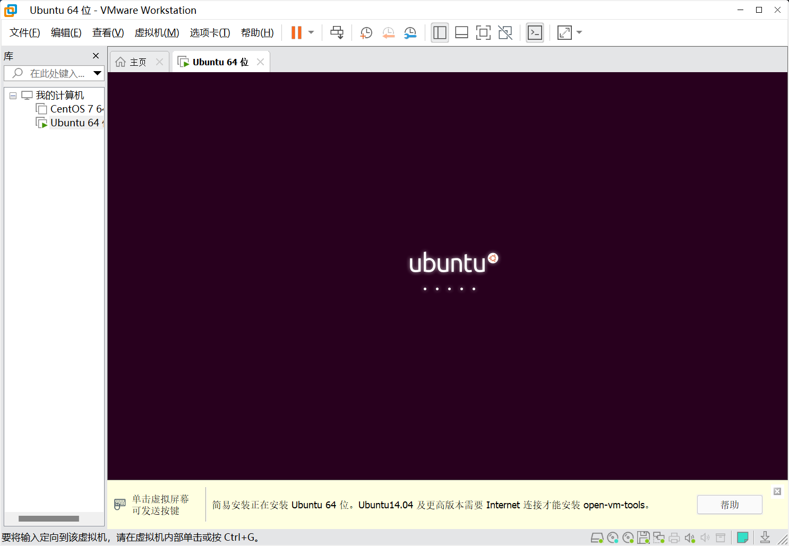

